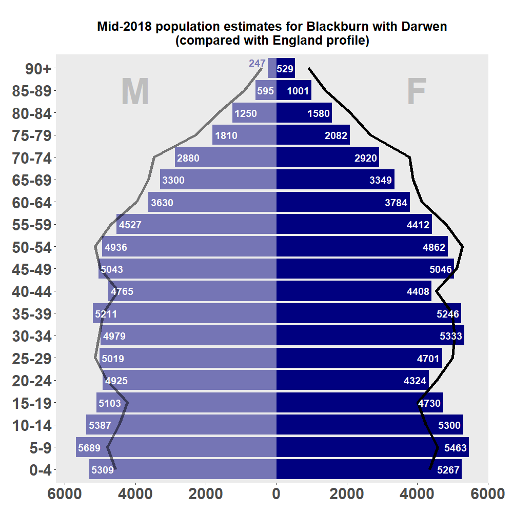
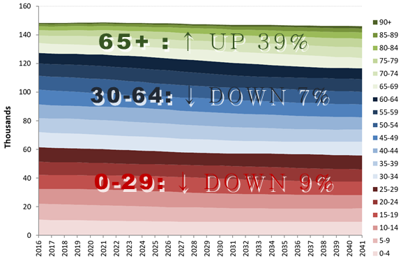

# Setting the Scene
## Population
###Population Estimates\
and Projections
#### Mid-2017 Estimates
The latest ONS population estimates _[@ONS_popest]_ are for mid-2017, and show that Blackburn with Darwen had a total of 148,772 residents (an increase of 310 since mid-2016). In Figure \@ref(fig:pyramid) below, the England age structure is superimposed for comparison. This illustrates that Blackburn with Darwen has a much younger age profile than average. 28.5% of its population is aged under 20, which is the 6th highest proportion in England.

(ref:pyramidcap) ONS mid-2017 population estimate for Blackburn with Darwen<br/>(with England profile for comparison)

```{r pyramid, fig.cap='(ref:pyramidcap)', echo=FALSE, out.width='75%',fig.align='center'}

```
#### Population Projections 
The latest population projections _[@ONS_popproj]_ are still based on the population estimates for mid-2016, and look ahead to 2041. For Blackburn with Darwen overall, they predict a slow, almost imperceptible fall in population (Figure \@ref(fig:projections)). However, the 65+ age-group (shown in green) is expected to rise by approximately 8,300 over the period - ie. by almost 40%. The 85+ group in particular is projected to rise by over 80%, from approximately 2400 to 4400.
```{r projections, fig.cap='(2016-based ONS population projections, Blackburn with Darwen)ref:pyramidcap)', echo=FALSE,out.width='75%', fig.align='center'}

```
### 2011 Census Data
#### Ethnicity
The 2011 Census _[@Nomis]_ is still our best source of data on the ethnic breakdown of the borough’s population, and the relationship between ethnic group and other social characteristics. The proportion of Blackburn with Darwen residents who described themselves as Indian or Pakistani are the 11th highest and the 6th highest respectively of any local authority in England.

(ref:ethcap) Ethnicity: Blackburn with Darwen v. NW and England, 2011<br/>(showing counts for Blackburn with Darwen)

```{r ethnicity, fig.cap='(ref:ethcap)', echo=FALSE,out.width='80%', fig.align='center'}
knitr::include_graphics("Assets/p3fig3.png")
```
The main ethnic groups have markedly different age profiles from each other (Figure \@ref(fig:ethpyramids), and are represented in varying concentrations across the borough (Figure \@ref(fig:ethmaps)).

(ref:ethpyrcap) Age profiles by ethnic group,<br/>Blackburn with Darwen, 2011

```{r ethpyramids, fig.cap='(ref:ethpyrcap)', echo=FALSE,out.width='75%', fig.align='center'}
knitr::include_graphics("Assets/p3fig4.png")
```
&nbsp;
```{r ethmaps, fig.cap='Blackburn with Darwen - ethnicity by ward', echo=FALSE,out.width='80%', fig.align='center'}
knitr::include_graphics("Assets/p3fig5.png")
```
#### Religion
At the 2011 Census, 77,599 Blackburn with Darwen residents (52.6%) identified themselves as Christian, and 39,817 (27.0%) as Muslim. 13.8% had no religion, and 5.6% did not answer the question. Religion and ethnicity are closely interlinked, with the vast majority of Christians in the borough being White, and almost all Muslims being Indian, Pakistani or members of other minority ethnic groups (Figure \@ref(fig:religion)).
```{r religion, fig.cap='Relationship between ethnicity and religion in Blackburn with Darwen', echo = FALSE, out.width = '60%', fig.align='center'}
knitr::include_graphics("Assets/p4fig6.png")
```
#### Language
For the first time, the 2011 Census asked about the ‘main language’ of everybody 
aged 3 or above. Over 86% of Blackburn with Darwen residents had English as their main language, but a multitude of other languages were also represented:
```{r language, fig.cap='Main language of Blackburn with Darwen residents aged 3+', echo = FALSE, out.width = '60%', fig.align='center'}
knitr::include_graphics("Assets/p4fig7.png")
```
Out of 57,353 households in Blackburn with Darwen, there were just over 4,000 where nobody had English as their main language, and just over 800 more where only children did:
&nbsp;
```{r language2, fig.cap='Main language by household', echo = FALSE, out.width = '60%', fig.align='center'}
knitr::include_graphics("Assets/p4fig8.png")
```
However, it is important to appreciate that many of those with a main language other than English nevertheless speak English ‘well’ or ‘very well’. Only 973 people in the borough could not speak it at all.

### Deprivation
The 2015 Index of Mutiple Deprivation _[@MHCLG2015]_ is still in use in 2018 (but expected to be replaced in Summer 2019). It is based on 37 indicators, mostly dating from around 2012/13.

#### Deprivation at the Lower Super Output Area (LSOA) level
The Index of Multiple Deprivation (IMD) is calculated for small neighbourhoods known as Lower Super Output Areas (LSOAs). Figure \@ref(fig:IMDmap) shows IMD 2015 mapped for Blackburn with Darwen’s 91 LSOAs. Nearly half (45 out of 91, or 49%) of the Borough’s LSOAs are in the worst two national deciles. By definition, each national decile accounts for 10% of all the LSOAs in England, so Blackburn with Darwen has well over its ‘fair share’ of deprived LSOAs.
```{r IMDmap, fig.cap='Index of Multiple Deprivation (IMD) 2015', echo = FALSE, out.width = '60%', fig.align='center'}
knitr::include_graphics("Assets/p5fig9.png")
```
#### Deprivation at the Borough level
There are various ways of summarising deprivation at the borough level. For example, the ‘Rank of Average Score’ method ranks authorities according to the average IMD score of their LSOAs. On that basis, Blackburn with Darwen ranks as 15th most deprived in 2015.

However, the summary indicator which is now most widely quoted is the proportion of LSOAs in the borough falling within the 10% most deprived in England (i.e. in National Decile 1). In Blackburn with Darwen, that proportion was 31% in 2015, which makes it the 12th most deprived borough. 

### Destitution
‘Destitution’ is a strong word, but the Joseph Rowntree Foundation estimates that over 1.5 million people in the UK were affected in this way at some point during  2017 _[@JRF2018]_. It defines ‘destitution’ as being on an extremely low income, and/or unable to afford two or more of the listed essentials over the past month:

* Shelter (had slept rough for 1+ nights
* Food (have had < 2 meals a day for 2+ days)
* Heating (have been unable to heat their home for 5+ days)
* Lighting (have been unable to light their home for 5+ days)
* Clothing and footwear (appropriate for weather)
* Basic toiletries (soap, shampoo, toothpaste, toothbrush)

A survey of crisis service users in various parts of the country was used to produce modelled estimates for every local authority. Authorities are ranked on their estimated destitution levels for each of three separate sub-populations (‘migrants’, ‘complex needs’ and ‘other’), and for all three groups put together. Blackburn with Darwen is in the most severe decile of destitution for two out of the three individual sub-populations. It just escapes being in the top decile for destitution overall, but only by one place _[@HW2018]_. 


### Life Expectancy
```{block2, type = 'newstuff'}
This section contains updated material 
&nbsp;
<div style="text-align: right;font-size:80%;"><em>[‘Sparkling’](https://thenounproject.com/term/sparkling/1200272) icon by Morten Halvorsen from [The Noun Project](https://thenounproject.com)</em></div>
```
Life expectancy in Blackburn with Darwen not only lags behind England (see shaded areas in Figure \@ref(fig:LEtrend)), but has plateaued in recent years for males, and actually fallen significantly since 2012-14 for females. In 2015-17, the borough had the 5th lowest life expectancy in England for females, and the 9th equal lowest for males, out of 324 lower-tier local authorities.

(ref:LEtrendcap) _(interactive)_ Life expectancy in England and Blackburn with Darwen

```{r LEtrend, fig.cap='(ref:LEtrendcap)', echo=FALSE,message = FALSE,out.width='85%', fig.align='center'}
# knitr::include_graphics("Assets/p6fig10.png")

BwDData <- fingertips_data(IndicatorID = 90366,AreaTypeID = 102,AreaCode = "E06000008",categorytype = TRUE) %>% 
  filter(Age == "All ages", is.na(CategoryType)) 
BwDData <- transmute(BwDData,`Area Codes` = AreaCode,period = paste(str_sub(Timeperiod,1,4),str_sub(Timeperiod,8,9),sep = "-"), LE = Value, Sex = if_else(Sex == "Male","M","F"))

EngData <- fingertips_data(IndicatorID = 90366,AreaCode = "E92000001",categorytype = TRUE) %>% 
  filter(Age == "All ages", is.na(CategoryType)) 
EngData <- transmute(EngData,`Area Codes` = AreaCode,period = paste(str_sub(Timeperiod,1,4),str_sub(Timeperiod,8,9),sep = "-"), LE = Value, Sex = if_else(Sex == "Male","M","F"))

LE <- bind_rows(BwDData,EngData) %>%
  mutate(LE = as.numeric(LE)) %>%
  mutate(linewidth = if_else(`Area Codes` == "E92000001",1,1.5)) %>%
  rename(Area = `Area Codes`) %>%
  mutate(Area = if_else(Area == "E92000001","England","BwD"))

LE <- unite(LE,"allgroups",Sex,Area) %>% select(allgroups,period,LE) %>% spread(allgroups,LE)

m <- list(
  l = 150,
  r = 50,
  b = 120,
  t = 60,
  pad = 4
)

p <- plot_ly(LE,x = ~period,y = ~F_England,name = "England Female",legendgroup = 'group1',type = 'scatter', mode = 'lines', 
             line = list(color = "Green",width = 1)) %>%
     add_trace(y = ~F_BwD,name = "BwD Female",fill = 'tonexty', fillcolor = 'rgba(252, 201, 252, 0.4)',legendgroup = 'group1',line = list(color = "Blue", width = 2.5)) %>%
     add_trace(y = ~M_England,name = "England Male",legendgroup = 'group2',line = list(color = "Green", width = 1)) %>%
     add_trace(y = ~M_BwD,name = "BwD Male",fill = 'tonexty', fillcolor = 'rgba(166, 209, 251, 0.4)',legendgroup = 'group2',line = list(color = "Blue",width = 2.5)) %>%
  add_annotations(
       x=2,
       y=80,
       xref = "x",
       yref = "y",
       text = "<b>F</b>",
       xanchor = 'center',
       showarrow = F,
       font = list(color = "#EE799F",size=20)
      ) %>%
     add_annotations(
       x=2,
       y=75.5,
       xref = "x",
       yref = "y",
       text = "<b>M</b>",
       xanchor = 'center',
       showarrow = F,
       font = list(color = "#6699CC",size=20)
      ) %>%
     add_annotations(
       x = 0.5,
       y = 1,
       xref = "paper",
       yref = "paper",
       text = "<span style='color:green'>England</span> v. <span style='color:blue'>Blackburn with Darwen</span>",
       font = list(size=16),
       showarrow = F,
       yanchor = "bottom"
     ) %>%
     layout(showlegend = FALSE, margin = m, xaxis = list(title = "",tickangle = 90), yaxis = list(title = "Life Expectancy (years)", hoverformat = '.1f'))
p
```
Even at a national level (green lines in Figure \@ref(fig:LEtrend)), the rate of improvement in life expectancy is much slower than it was. These trends are attracting increasing amounts of attention and comment, including an acknowledgement by ONS of their statistical significance, and an undertaking to investigate further _[@KF2017; @ONS_changetrend]_.

```{r echo = FALSE, warning = FALSE, message = FALSE}
LEDepData <- fingertips_data(IndicatorID = 90366,AreaTypeID = 102,AreaCode = "E06000008",categorytype = TRUE) %>% 
  filter(CategoryType == "LSOA11 deprivation deciles within area (IMD2015)") 
latest_date <- max(LEDepData$TimeperiodSortable)
LEDepData <- filter(LEDepData,TimeperiodSortable == latest_date)
latest_period <- first(LEDepData$Timeperiod)

LEDepData$Category <- factor(LEDepData$Category,levels = c("Most deprived decile","Second most deprived decile","Third more deprived decile","Fourth more deprived decile",
                                                 "Fifth more deprived decile","Fifth less deprived decile","Fourth less deprived decile","Third less deprived decile",
                                                 "Second least deprived decile","Least deprived decile"))
levels(LEDepData$Category)[levels(LEDepData$Category)=="Third more deprived decile"] <- "Third most deprived decile"
levels(LEDepData$Category)[levels(LEDepData$Category)=="Fourth more deprived decile"] <- "Fourth most deprived decile"
levels(LEDepData$Category)[levels(LEDepData$Category)=="Fifth more deprived decile"] <- "Fifth most deprived decile"
levels(LEDepData$Category)[levels(LEDepData$Category)=="Third less deprived decile"] <- "Third least deprived decile"
levels(LEDepData$Category)[levels(LEDepData$Category)=="Fourth less deprived decile"] <- "Fourth least deprived decile"
levels(LEDepData$Category)[levels(LEDepData$Category)=="Fifth less deprived decile"] <- "Fifth least deprived decile"

# plotly version
male <- filter(LEDepData,Sex == "Male")
male$fv <- male %>% lm(Value ~ as.integer(Category),.) %>% fitted.values()
male$hiarm <- male$UpperCI95.0limit - male$Value
male$loarm <- male$Value - male$LowerCI95.0limit
male$mytext <- paste(male$Category,": ",round(male$Value,1)," years",sep="")
malecontrast <- male$Value[levels(male$Category)=="Least deprived decile"] - male$Value[levels(male$Category)=="Most deprived decile"]
malecontrast <- round(malecontrast,1)

female <- filter(LEDepData,Sex == "Female")
female$fv <- female %>% lm(Value ~ as.integer(Category),.) %>% fitted.values()
female$hiarm <- female$UpperCI95.0limit - female$Value
female$loarm <- female$Value - female$LowerCI95.0limit
female$mytext <- paste(female$Category,": ",round(female$Value,1)," years",sep="")
femalecontrast <- female$Value[levels(female$Category)=="Least deprived decile"] - female$Value[levels(female$Category)=="Most deprived decile"]
femalecontrast <- round(femalecontrast,1)
```
There is also striking inequality in life expectancy _within_ Blackburn with Darwen. To illustrate this, Public Health England has ranked the borough’s LSOAs by IMD score, divided them into ten equal groups (‘deciles’) of deprivation, and calculated the life expectancy for each _[@PHE_download]_.  As Figure \@ref(fig:slopechart) shows, the difference between the most and least deprived tenths of the borough was `r malecontrast` years for males in `r latest_period`. For females, it was `r femalecontrast` years.

(ref:slopecap) _(interactive)_ Life expectancy by deprivation decile,<br/>Blackburn with Darwen, `r latest_period`

```{r slopechart, fig.cap='(ref:slopecap)', echo=FALSE,out.width='85%', fig.align='center'}
#knitr::include_graphics("Assets/p6fig11.png")

m <- list(
  l = 150,
  r = 50,
  b = 120,
  t = 60,
  pad = 4
)

p1 <- plot_ly(male,x = ~Category) %>%
  add_trace(y = ~fv, type = 'scatter',mode = 'lines',showlegend = FALSE,line = list(color = "Gray",width = 1,dash = 'dot'), hoverinfo = 'none') %>%
  add_trace(y = ~Value, text = ~mytext, hoverinfo = "text", name = "Male", type = 'scatter',mode = 'markers', marker = list(color = "#66B2FF",size = 15),
            error_y = list(symmetric = FALSE,array = ~hiarm,arrayminus = ~loarm, type = "bar", color = "#0066CC")) %>%
  layout(xaxis = list(title = "",tickangle = 90))
p2 <- plot_ly(female,x = ~Category) %>%
  add_trace(y = ~fv, type = 'scatter',mode = 'lines',showlegend = FALSE,line = list(color = "Gray",width = 1,dash = 'dot'), hoverinfo = 'none') %>%
  add_trace(y = ~Value, text = ~mytext, hoverinfo = "text", name = "Female", type = 'scatter',mode = 'markers', marker = list(color = "#FF99CC",size = 15),
            error_y = list(symmetric = FALSE,array = ~hiarm,arrayminus = ~loarm, type = "bar", color = "#CC0066")) %>%
  layout(xaxis = list(title = "",tickangle = 90))
p <- subplot(p1,p2, shareY=TRUE) %>%
  layout(margin = m, yaxis = list(title = "Life Expectancy (years)", tickfont = list(size = 15)),legend = list(orientation = 'h', xanchor = "center",yanchor = "bottom",x=0.5,y=1,bgcolor = "#F5F5F5",font = list(size = 20)))
p
```

### Premature Mortality
```{block2, type = 'newstuff'}
This section contains updated material 
&nbsp;
<div style="text-align: right;font-size:80%;"><em>[‘Sparkling’](https://thenounproject.com/term/sparkling/1200272) icon by Morten Halvorsen from [The Noun Project](https://thenounproject.com)</em></div>
```
The inequalities between more and less deprived parts of the borough are also illustrated in the PHE Health Profile for Blackburn with Darwen _[@PHE_HP]_.  The gap in premature death rates is particularly stark for men:

(ref:premcap) Premature mortality (under 75, Male & Female)<br/>for England, Blackburn with Darwen,<br/>& most/least deprived quintiles of Blackburn with Darwen

```{r premchart, fig.cap='(ref:premcap)', echo=FALSE,out.width='95%', fig.align='center'}
#knitr::include_graphics("Assets/p6fig12.png")

BwDData <- fingertips_data(IndicatorID = 108,AreaTypeID = 102,AreaCode = "E06000008",categorytype = TRUE) %>%
  filter(Sex != "Persons")
latest_date <- max(BwDData[!is.na(BwDData$Category),]$TimeperiodSortable) # Don't want latest year if they haven't yet got round to
                                                                          # doing inequalities data for it
BwDData <- filter(BwDData,TimeperiodSortable <= latest_date)

EngData <- fingertips_data(IndicatorID = 108,AreaCode = "E92000001",categorytype = TRUE) %>%
  filter(Sex != "Persons",TimeperiodSortable <= latest_date, is.na(CategoryType))

PM <- bind_rows(BwDData,EngData) %>%
  transmute(Area = if_else(AreaCode == "E92000001","England","BwD"), Category, period = paste(str_sub(Timeperiod,1,4),str_sub(Timeperiod,8,9),sep = "-"), 
            DSR = round(Value,1), Sex = if_else(Sex == "Male","M","F") )

male <- filter(PM,Sex == "M") %>% unite("allgroups",Area,Category) %>% select(allgroups,period,DSR) %>% spread(allgroups,DSR)
female <- filter(PM,Sex == "F") %>% unite("allgroups",Area,Category) %>% select(allgroups,period,DSR) %>% spread(allgroups,DSR)

m <- list(
  l = 100,
  r = 150,
  b = 120,
  t = 60,
  pad = 4
)

p1 <- plot_ly(male,x = ~period,y = ~`BwD_Most deprived quintile`,name = "BwD",text = ~ paste("<em>Most Deprived Quintile</em><br />",period,"<br />","Rate: <b>", `BwD_Most deprived quintile`,'</b>',""),type = 'scatter', mode = 'lines+markers', 
             line = list(color = "Blue",width = 1), marker = list(size = 5, color = "Blue"), fill = 'tozeroy',fillcolor = 'rgba(0,0,255, 0.1)',hoverinfo = "text+name") %>%
      add_trace(y = ~`BwD_Least deprived quintile`,name = "BwD",text = ~ paste("<em>Least Deprived Quintile</em><br />",period,"<br />","Rate: <b>",`BwD_Least deprived quintile`,'</b>',""),type = 'scatter', mode = 'lines+markers', 
                line = list(color = "Blue",width = 1,dash = 'dot'),marker = list(size = 5, color = "Blue"), fill = 'tozeroy',fillcolor = 'rgb(255, 255, 255)',hoverinfo = "text+name") %>%
      add_trace(y = ~BwD_NA, name = "BwD",text = ~ paste("<em>Overall</em><br />",period,"<br />","Rate: <b>", BwD_NA,'</b>',""),type = 'scatter', mode = 'lines+markers', line = list(color = "Blue",width = 2), marker = list(size = 10, color = "Blue"), fill = 'none',hoverinfo = "text+name") %>%
      add_trace(y = ~England_NA, name = "England",text = ~ paste(period,"<br />","Rate: <b>", England_NA,'</b>',""),type = 'scatter', mode = 'lines+markers', line = list(color = "Green",width = 1.5), marker = list(size = 7, color = "Green"), fill = 'none',hoverinfo = "text+name") %>%
      add_annotations(
        x=0.15,
        y=850,
        xref = "paper",
        yref = "y",
        text = "<b>M</b>",
        xanchor = 'center',
        showarrow = F,
        font = list(color = "#6699CC",size=20)
      ) %>%
     layout(showlegend = FALSE, xaxis = list(showgrid = FALSE,zeroline = FALSE, showline = FALSE, title = "",tickangle = 90,tickfont = list(size = 15)))

p2 <- plot_ly(female,x = ~period,y = ~`BwD_Most deprived quintile`,name = "BwD",text = ~ paste("<em>Most Deprived Quintile</em><br />",period,"<br />","Rate: <b>", `BwD_Most deprived quintile`,'</b>',""),type = 'scatter', mode = 'lines+markers', 
              line = list(color = "Blue",width = 1), marker = list(size = 5, color = "Blue"), fill = 'tozeroy',fillcolor = 'rgba(252, 201, 252, 0.4)',hoverinfo = "text+name") %>%
      add_trace(y = ~`BwD_Least deprived quintile`,name = "BwD",text = ~ paste("<em>Least Deprived Quintile</em><br />",period,"<br />","Rate: <b>",`BwD_Least deprived quintile`,'</b>',""),type = 'scatter', mode = 'lines+markers', 
            line = list(color = "Blue",width = 1,dash = 'dot'),marker = list(size = 5, color = "Blue"), fill = 'tozeroy',fillcolor = 'rgb(255, 255, 255)',hoverinfo = "text+name") %>%
      add_trace(y = ~BwD_NA, name = "BwD",text = ~ paste("<em>Overall</em><br />",period,"<br />","Rate: <b>", BwD_NA,'</b>',""),type = 'scatter', mode = 'lines+markers', line = list(color = "Blue",width = 2), marker = list(size = 10, color = "Blue"), fill = 'none',hoverinfo = "text+name") %>%
      add_trace(y = ~England_NA, name = "England",text = ~ paste(period,"<br />","Rate: <b>", England_NA,'</b>',""),type = 'scatter', mode = 'lines+markers', line = list(color = "Green",width = 1.5), marker = list(size = 7, color = "Green"), fill = 'none',hoverinfo = "text+name") %>%
      add_annotations(x = 0.95,y = female[nrow(female),]$`BwD_Most deprived quintile`,xref = "paper",yref = "y",text = " Most deprived<br> quintile of BwD",xanchor = "left",yanchor = "bottom",showarrow = F,font = list(color = "Blue",size = 12)) %>%
      add_annotations(x = 0.95,y = female[nrow(female),]$`BwD_NA`,xref = "paper",yref = "y",text = sprintf(" <b>BwD overall</b>"),xanchor = "left",yanchor = "middle",showarrow = F,font = list(color = "Blue",size = 15)) %>%
      add_annotations(x = 0.95,y = female[nrow(female),]$`England_NA`,xref = "paper",yref = "y",text = " England",xanchor = "left",yanchor = "middle",showarrow = F,font = list(color = "Green",size = 15)) %>%
      add_annotations(x = 0.95,y = female[nrow(female),]$`BwD_Least deprived quintile`,xref = "paper",yref = "y",text = " Least deprived<br> quintile of BwD",xanchor = "left",yanchor = "top",showarrow = F,font = list(color = "Blue",size = 12)) %>%
      add_annotations(
        x=0.15,
        y=550,
        xref = "paper",
        yref = "y",
        text = "<b>F</b>",
        xanchor = 'center',
        showarrow = F,
        font = list(color = "#EE799F",size=20)
      ) %>%
      layout(showlegend = FALSE, xaxis = list(showgrid = FALSE,zeroline = FALSE, showline = FALSE, title = "",tickangle = 90,tickfont = list(size = 15)))

p <- subplot(p1,p2, shareY=TRUE) %>%
      layout(margin = m, yaxis = list(showgrid = FALSE,zeroline = FALSE, showline = FALSE,tickfont = list(size = 15), tickprefix = "  ",title = "Directly Standardised Rate per 100,000",titlefont = list(size = 18)))
p
```

## Local Economy
Any analysis of health and social care needs would be incomplete without a quick introduction to the local economy, not only because it helps to set the context, but also because the economy is a major determinant of health. 

### Skills
In 2017, there were estimated to be 11,000 people aged 16-64 in Blackburn with Darwen with no qualifications, or 12.1% of the working-age population (England 7.6%) _[@CC2018]_.  Clearly such a high rate (ranking 21st among upper-tier authorities) is undesirable. Data from the Centre for Cities provides a stark illustration of the relationship between lack of qualifications and the employment rate (Figure \@ref(fig:skillchart)) _[@CC2018]_.

(ref:skillcap) Relationship between employment rate and lack of qualifications<br/><em>'Primary Urban Areas' in England. Source: Centre for Cities</em>

```{r skillchart, fig.cap='(ref:skillcap)', echo=FALSE,out.width='60%', fig.align='center'}
knitr::include_graphics("Assets/p7fig13.png")
```

At the other end of the spectrum, 21.4% of people aged 16-64 in Blackburn with Darwen had a degree or equivalent in 2017. This is still well below average (England 31.1%), but it continues a gradually improving trend, and means that the borough is on the verge of leaving the bottom quintile of local authorities _[@Nomis]_. 

The proportion of the borough’s 19-year-olds qualified to Level 3 (i.e. two A-levels or equivalent) has also shown steady improvement over the years (Figure \@ref(fig:qual19chart)) _[@DfE_age19]_. 

```{r qual19chart, fig.cap='Level 3 qualification at age 19', echo = FALSE, out.width = '60%', fig.align='center'}
knitr::include_graphics("Assets/p7fig14.png")
```

### Economic Activity
As seen in Figure \@ref(fig:activitychart), an estimated 65.3% of the borough’s residents aged 16-64 are employed _[@Nomis]_. This is the 9th lowest rate out of 150 upper tier local authorities (not including the City of London and Scilly Isles).

Together with those who are officially unemployed (i.e. actively seeking work and available to start), it means that only 69.7% are ‘economic active’, which is the 2nd lowest rate in England (again not including the City of London or Scilly Isles). 

(ref:activitycap) Economic activity and inactivity & employment rate<br/>(age 16-64, year ending March 2018) _[@Nomis]_

```{r activitychart, fig.cap='(ref:activitycap)', echo=FALSE,out.width='60%', fig.align='center'}
knitr::include_graphics("Assets/p7fig15.png")
```

### Looking for Work
#### Unemployment
Strictly speaking, unemployment is defined by whether people are actively seeking work and available to start, rather than by any benefits they may be claiming. This can only be ascertained from a sample survey, so the estimates for an area such as Blackburn with Darwen are subject to large confidence intervals (Figure \@ref(fig:unempchart)). The latest results (for April 2017 – March 2018) suggest that there are approximately 4000 unemployed people of working age in Blackburn with Darwen. It is conventional to express this as a percentage of the economically active population, which gives a rate of 6.3%.

(ref:unempcap) Unemployment rate (age 16-64),<br/>Blackburn with Darwen, North West and England<br/><em>(showing 95% confidence intervals for BwD)[@Nomis]</em>

```{r unempchart, fig.cap='(ref:unempcap)', echo=FALSE,out.width='60%', fig.align='center'}
knitr::include_graphics("Assets/p8fig16.png")
```

#### Claimant Count
```{block2, type = 'newstuff'}
This section contains updated material 
&nbsp;
<div style="text-align: right;font-size:80%;"><em>[‘Sparkling’](https://thenounproject.com/term/sparkling/1200272) icon by Morten Halvorsen from [The Noun Project](https://thenounproject.com)</em></div>
```
It is obvious from Figure \@ref(fig:unempchart) that it would be useful to have a proxy for the official unemployment count, which does not depend on a survey. For many years, that need was met by the Claimant Count. Since the introduction of Universal Credit, however, things have not been quite so simple.

```{r echo = FALSE, warning = FALSE, message = FALSE, fig.align='center'}
# Want all dates from April 2015 (= 32244) to latest. Found out that April 2015 was '32244' by doing https://www.nomisweb.co.uk/api/v01/dataset/nm_1_1.overview.xml
nomisurl <- 'http://www.nomisweb.co.uk/api/v01/dataset/NM_162_1.data.csv?geography=1870659597,2092957699,2013265922&date=32244-latest&gender=0&age=0&measure=1,2&measures=20100&select=date_name,date_sortorder,geography_name,measure_name,obs_value'

nomisdata <- read.csv(file=nomisurl, header=TRUE,sep = ",")

# put DATE_NAME in chronological order
nomisdata$DATE_NAME <- factor(nomisdata$DATE_NAME,levels=unique(nomisdata$DATE_NAME[order(nomisdata$DATE_SORTORDER)]),ordered=TRUE)

# substitute snappier measure names
nomisdata$MEASURE_NAME <- as.character(nomisdata$MEASURE_NAME)
nomisdata <- within(nomisdata,{
  MEASURE_NAME[MEASURE_NAME == "Claimants as a proportion of residents aged 16-64"] <- "rate"
  MEASURE_NAME[MEASURE_NAME == "Claimant count"] <- "count"
})

nomisdata <- cast(nomisdata,DATE_NAME+DATE_SORTORDER+GEOGRAPHY_NAME~MEASURE_NAME) # Now has 'count' and 'rate' as separate columns

bwdLatest <- nomisdata[which(nomisdata$DATE_SORTORDER == max(nomisdata$DATE_SORTORDER) & nomisdata$GEOGRAPHY_NAME == "Blackburn with Darwen"),]
bwdLatestCount <- bwdLatest$count
bwdLatestRate <- bwdLatest$rate
latestDate <- bwdLatest$DATE_NAME
nomisdata$geogAbb <- ifelse(nomisdata$GEOGRAPHY_NAME == 'Blackburn with Darwen','BwD',as.character(nomisdata$GEOGRAPHY_NAME))
```
The Claimant Count now consists of the (diminishing) number of people still on Job Seekers Allowance, plus those claiming Universal Credit _who are required to seek work_ _[@HCL_unemp]_.  It is available on this basis going back to April 2015 (Figure \@ref(fig:claimcountchart)). The latest Claimant Count total for the borough (in `r latestDate`) was `r bwdLatestCount`. As a percentage of the working-age population (not just the economically active), this gives a rate of `r bwdLatestRate`%.

(ref:claimcountcap) _(interactive)_ Claimant Count as a % of residents aged 16-64 _[@Nomis]_

```{r claimcountchart, fig.cap='(ref:claimcountcap)', echo = FALSE, warning = FALSE, message = FALSE, fig.align='center'}
#

pal <- c("red","blue","green")
pal <- setNames(pal,c("North West","BwD","England"))

xx <- list(
  title = ""
)
yx <- list(
  title = "",
  ticksuffix = "%"
)

m <- list(
  l = 50,
  r = 50,
  b = 120,
  t = 60,
  pad = 4
)

p <- nomisdata %>%
  group_by(geogAbb) %>%
  plot_ly(x = ~DATE_NAME,y = ~rate,color = ~ geogAbb) %>%
  add_lines(text = ~ paste(DATE_NAME,"<br />",
                          "Rate: <b>",rate,'%</b>',
                          ifelse(geogAbb == "BwD",paste0("<br /><em>(",count," people)</b>"),"")),
            colors = pal,
            hoverinfo = "text+name") %>%
  layout(xaxis = xx, yaxis = yx, margin = m,
         legend = list(x = 0.1, y = 0.9)
         )

p
```

##### Impact of Universal Credit 'Full Service'
However, **Figure \@ref(fig:claimcountchart) must be interpreted with caution**. As Universal Credit is rolled out, the rules about who is required to seek work in order to receive benefit keep changing. This makes it difficult to interpret trends in the Claimant Count, and has led ONS to demote it to an ‘Experimental Statistic’.

Judging by Figure \@ref(fig:claimcountchart), it might be thought that the Blackburn with Darwen economy has taken a turn for the worse since February 2018. However, that is not necessarily the case, because in February 2018, the borough became a **‘Full Service’** area for Universal Credit.^[‘Full Service’ means that Universal Credit is available to all types of new claimants, rather than being restricted (as before) to those whose claims are relatively simple.]  More people are required to seek work under Universal Credit than under the legacy benefits that it replaces, so the recent sharp rise in the Claimant Count may well reflect the fact that the ‘goalposts’ have moved. A similar sharp rise was seen in areas which moved to Full Service last year (2017) _[@HCL_unemp]_.

##### Claimant Count Across the Borough
The fact that it is difficult to interpret the _trend_ in the Claimant Count does not prevent us from looking at how it varies _across the Borough_ at a snapshot in time. Figure \@ref(fig:claimmap) shows how the rate as at August 2018 ranged from 0.3% in North Turton with Tockholes, to 8.2% in Wensley Fold.

(ref:claimmapcap) Claimant Count rates at ward level, August 2018,<br/>as a % of residents aged 16-64<br/><em>(pre-2018 wards) [@Nomis]</em>

```{r claimmap, fig.cap='(ref:claimmapcap)', echo=FALSE,out.width='60%', fig.align='center'}
knitr::include_graphics("Assets/p8fig18.png")
```

### Employment by Sector
Both locally and nationally, the biggest sector for employment is Health (Figure \@ref(fig:sectorchart)). Health, Education and Public Admininstration together account for just over a third of Blackburn with Darwen employees, compared with a national average of just over a quarter. 16.4% of employees in Blackburn with Darwen work in Manufacturing, which is more than twice the England average of 8.1%.

(ref:sectorcap) Employees by sector - <br/>Blackburn with Darwen compared with England (2017)<br/><em>Source: BRES data from Nomis [@Nomis]</em>

```{r sectorchart, fig.cap='(ref:sectorcap)', echo=FALSE,out.width='60%', fig.align='center'}
knitr::include_graphics("Assets/p9fig19.png")
```

### Productivity
Productivity describes the ability to produce outputs from a given amount of inputs such as labour. Economic output can only be increased by raising the amount of inputs (e.g. employees) or by raising their productivity, so productivity is vital to improving standards of living _[@ONS_productivity]_.  

The preferred sub-regional measure of productivity is Gross Value Added (GVA) per hour worked. On this basis, Blackburn with Darwen has the 12th lowest productivity out of 168 ‘NUTS 3’ areas in the UK (Figure \@ref(fig:GVAchart)), at 77.6% of the UK average _[@ONS_productivity]_.

(ref:GVAcap) Productivity (GVA per hour worked) -<br/>20 lowest ranking NUTS3 areas, relative to UK (2016)

```{r GVAchart, fig.cap='(ref:GVAcap)', echo=FALSE,out.width='60%', fig.align='center'}
knitr::include_graphics("Assets/p9fig20.png")
```

### Earnings
```{block2, type = 'newstuff'}
This section contains updated material 
&nbsp;
<div style="text-align: right;font-size:80%;"><em>[‘Sparkling’](https://thenounproject.com/term/sparkling/1200272) icon by Morten Halvorsen from [The Noun Project](https://thenounproject.com)</em></div>
```
```{r echo = FALSE, warning = FALSE, message = FALSE}
earnings <- read.csv('http://www.nomisweb.co.uk/api/v01/dataset/NM_30_1.data.csv?geography=1941962826,1941962832,1941962827,1941962833,1941962834,1941962828,1941962835,1941962829,1941962830,1941962836,1941962831,1941962803,1941962807,1941962804,1941962808...1941962810,1941962805,1941962811,1941962806,1941962851...1941962855,1941962837,1941962838,1941962856...1941962859,1941962839...1941962841,1941962860...1941962863,1941962842,1941962843,1941962864,1941962844,1941962845,1941962865,1941962846,1941962866,1941962867,1941962847,1941962868,1941962848,1941962869,1941962849,1941962850,1941962754,1941962753,1941962760,1941962755,1941962756,1941962761,1941962762,1941962757,1941962758,1941962763,1941962759,1941962764...1941962766,1941962772,1941962773,1941962767,1941962768,1941962771,1941962769,1941962783,1941962782,1941962784,1941962774...1941962777,1941962785,1941962786,1941962778...1941962780,1941962770,1941962781,1941962787,1941962870,1941962871,1941962882...1941962884,1941962872,1941962885,1941962873,1941962874,1941962886,1941962875...1941962878,1941962887,1941962879,1941962888,1941962880,1941962881,1941962889...1941962892,1941962901...1941962903,1941962893...1941962896,1941962904,1941962897...1941962900,1941962818...1941962820,1941962812,1941962821,1941962813,1941962822,1941962816,1941962814,1941962815,1941962823,1941962817,1941962824,1941962825,1941962794,1941962798,1941962799,1941962795,1941962788,1941962789,1941962800,1941962801,1941962790,1941962791,1941962793,1941962796,1941962797,1941962802,1941962792,2092957699,2013265922&date=latest&sex=7&item=2&pay=1&measures=20100,20701&select=date_name,geography_name,geography_code,sex_name,pay_name,item_name,measures_name,obs_value,obs_status_name')

bwdearnings <- earnings %>% filter(GEOGRAPHY_CODE == "E06000008" & MEASURES_NAME == "Value") %>% select(OBS_VALUE)
Englandearnings <- earnings %>% filter(GEOGRAPHY_CODE == "E92000001" & MEASURES_NAME == "Value") %>% select(OBS_VALUE)
NWearnings <- earnings %>% filter(GEOGRAPHY_CODE == "E12000002" & MEASURES_NAME == "Value") %>% select(OBS_VALUE)

bwdearnings <- as.numeric(bwdearnings)
Englandearnings <- as.numeric(Englandearnings)
NWearnings <- as.numeric(NWearnings)

thisyear <- first(earnings$DATE_NAME)

mainearnings <- earnings %>% filter(MEASURES_NAME == "Value") %>%
  filter(GEOGRAPHY_CODE != "E92000001" & GEOGRAPHY_CODE != "E12000002") %>% # eliminate England and Nw
  filter(!is.na(OBS_VALUE)) %>% # effectively eliminates Scilly
  mutate(earnrank = rank(OBS_VALUE)) %>%
  arrange(earnrank) %>%
  select(GEOGRAPHY_NAME,GEOGRAPHY_CODE,earnings = OBS_VALUE,earnrank) %>%
  mutate(BwD = ifelse(GEOGRAPHY_NAME == "Blackburn with Darwen",1,0)) %>%
  mutate(Englandearnings = Englandearnings) %>%
  mutate(NWearnings = NWearnings)

mainearnings$GEOGRAPHY_NAME <- factor(mainearnings$GEOGRAPHY_NAME) #drop unused levels
mainearnings$GEOGRAPHY_NAME <- reorder(x = mainearnings$GEOGRAPHY_NAME,X = mainearnings$earnings,FUN = sum)
mainearnings$GEOGRAPHY_CODE <- factor(mainearnings$GEOGRAPHY_CODE) #drop unused levels
mainearnings$BwD <- factor(mainearnings$BwD)
mainearnings$my_hover <- paste0(mainearnings$GEOGRAPHY_NAME,": ",sprintf("£%.2f", mainearnings$earnings),sep="")

bwdearnrank <- mainearnings %>% filter(GEOGRAPHY_CODE == "E06000008") %>% select(earnrank)
bwdearnrankfloor <- floor(bwdearnrank)
bwdearnrankjoint <- ifelse(bwdearnrank == bwdearnrankfloor,"","joint ") # e.g. if rank is '8.5', that means a tie
bwdrank <- paste0(bwdearnrankjoint,toOrdinal(bwdearnrankfloor),"")
bwdrank <- ifelse(bwdrank == "1st","",bwdrank) # Don't want to say '1st lowest'
numLAs <- nrow(mainearnings)
```
Provisional median gross weekly earnings for Blackburn with Darwen residents in `r thisyear` were £`r bwdearnings`. This puts Blackburn with Darwen `r bwdrank` lowest out of `r numLAs` upper-tier authorities in England (Figure \@ref(fig:earnchart)) _[@Nomis]_.

(ref:earncap) _(interactive)_ Provisional Median Gross Weekly Earnings of residents -<br/><span style='color:blue'>Blackburn with Darwen</span> v. other Upper-Tier Authorities in England (`r thisyear`) <em>[@Nomis]</em>

```{r earnchart, fig.cap='(ref:earncap)', echo=FALSE,out.width='100%', fig.align='center'}
# knitr::include_graphics("Assets/p9fig21.png")
# Plotly chart
m <- list(
  l = 50,
  r = 50,
  b = 30,
  t = 10,
  pad = 4
)

p <- plot_ly(mainearnings,x = ~GEOGRAPHY_NAME,y = ~earnings,
        type = "bar", text = ~my_hover, hoverinfo = "text",
        color = ~BwD, colors = c("Lightblue","Blue")) %>%
  
    add_trace(y = ~Englandearnings, type = "scatter", mode = "lines", line = list(color = "Green")) %>%
    add_trace(y = ~NWearnings,type = "scatter", mode = "lines",line = list(color = "Red")) %>%
    
    add_annotations(xref = "paper",yref = "y",x = 1,y = Englandearnings,xanchor = "right",yanchor = "bottom",
                    text = paste0("England: ",sprintf("£%.2f", Englandearnings),sep=""),
                    showarrow = F, font = list(color = "Green", size = 12)) %>%
    add_annotations(xref = "paper",yref = "y",x = 1,y = NWearnings,xanchor = "right",yanchor = "top",
                    text = paste0("North West: ",sprintf("£%.2f", NWearnings),sep=""),
                    showarrow = F, font = list(color = "Red", size = 12)) %>%
  
    layout(margin = m, showlegend = FALSE,bargap = 0, 
    xaxis = list(title = "", showspikes = TRUE, showticklabels = FALSE,
      tickfont = list(color = "White")), # Don't want to see x-axis labels but still want showspikes to work
    yaxis = list(title = "", tickprefix = "£", hoverformat = '.2f')) 
p
```

### Household Income
#### Gross Disposable Household Income
Gross Disposable Household Income (GDHI) is the amount of money that individuals in households have available for spending after taxes and benefits. Provisional estimates for 2016 are now available by local authority _[@ONS_grossdisp]_.  

The Blackburn with Darwen average of £12,450 per head is the 2nd lowest in the UK (after Nottingham), and the lowest in the North West. It compares with an England average of £19,878. Blackburn with Darwen has consistently been in 2nd or 3rd lowest place for the past six years.

(ref:dispinccap) Gross Disposable Household Income per head (2016, provisional): <br/>lowest and highest local authority per region

```{r dispincchart, fig.cap='(ref:dispinccap)', echo=FALSE,out.width='90%', fig.align='center'}
knitr::include_graphics("Assets/p10fig22.png")
```

#### Total Household Income
ONS also issues various modelled estimates of household income at the smaller Middle Super Output Area (MSOA) level _[@ONS_smallinc]_. Figure \@ref(fig:hhldincchart) shows a map of how Total Annual Household Income (before tax) varies across the borough.

Half of Blackburn with Darwen’s 18 MSOAs are in the bottom national decile for household income (darkest purple), with estimated average incomes ranging from £20,100 to £29,100. Eight of them form a broad swathe across Blackburn. The lowest of all is in Audley, and this MSOA ranks third lowest in England (out of 6791). The next lowest MSOA in Blackburn with Darwen, covering the town centre area, ranks 11th lowest in England. By contrast, Blackburn with Darwen also has one MSOA in the second-highest national decile (dark green), with an estimated average of £51,500.

It is stressed that these are only estimates, with a wide degree of uncertainty around them.

(ref:hhldinccap) Estimated Total Annual Household Income (MSOAs, 2015/16)<br/><em>NB- measured per household, not per head</em>

```{r hhldincchart, fig.cap='(ref:hhldinccap)', echo=FALSE,out.width='60%', fig.align='center'}
knitr::include_graphics("Assets/p10fig23.png")
```

## Safe and Healthy Homes\
and Neighbourhoods
### Housing
#### Private Rented Sector
>“The private-rented sector in the UK is growing and has worse housing conditions than any other sector.”
>
> --- Parliamentary Office of Science & Technology _[POST]_

##### Housing Conditions
Evidence from the English Housing Survey shows that the private rented sector nationally has the highest rate of serious (‘Category 1’) hazards, including excess cold and risk of falls (Figure \@ref(fig:housecondchart)) _[@POST2018]_. Private rented housing was also the most likely to be old, to be non-decent (a broader classification, including problems of disrepair and ageing facilities), and to be suffering from damp _[@POST2018; @MHCLG2018]_.

(ref:housecondcap) National findings from the English Housing Survey (2015) <em>[@POST2018]</em><br/><em>('HHARS' = Housing Health and Safety Rating System)</em>

```{r housecondchart, fig.cap='(ref:housecondcap)', echo=FALSE,out.width='60%', fig.align='center'}
knitr::include_graphics("Assets/p11fig24.png")
```

##### Local Market
Modelled estimates (which ONS stress are _not_ official statistics) suggest that Blackburn with Darwen had approximately 8500 privately rented houses in 2012, and 1000 more by 2015 _[@ONS_tenure]_.  Data from the Valuation Office Agency (VOA) shows that median private-sector rents in Blackburn with Darwen (and in Burnley, Pendle and Hyndburn) in the year to March 2018 were in the bottom 15 nationally, and the rental for a non-self-contained room in Blackburn with Darwen was the lowest in the NW _[@VOA2018]_.

##### Regulation
Multi-tenanted ‘Houses in Multiple Occupation’ (HMOs) often house some of the most vulnerable people in society. Since 2004, large HMOs of three storeys or more have had to be licensed (Figure \@ref(fig:hmomap)). New legislation means that many more HMOs will require to be licensed from October 2018.

Councils can also impose a selective licensing scheme for private rented housing more generally, in areas of low demand. Such areas may be suffering from problems such as high turnover, high levels of disrepair, and anti-social behaviour. Blackburn with Darwen currently has two such schemes, one in Darwen and one in the Infirmary area of Blackburn (Figure \@ref(fig:hmomap)), and finds them to be an effective tool for driving up housing standards and reversing neighbourhood decline _[@BwD_Infirmary; @BwD_Darwen]_.

```{r hmomap, fig.cap='Licensed HMOs & Selective Licensing Areas in BwD', echo = FALSE, out.width = '60%', fig.align='center'}
knitr::include_graphics("Assets/p11fig25.png")
```

##### Cold housing and Fuel Poverty
As well as being a major contributor to excess winter deaths, cold housing adds to the burden of circulatory and respiratory disease, colds and flu, exacerbates chronic conditions such as rheumatism and arthritis, and has a negative effect upon mental health across all age-groups _[@MRT2011]_.  

An estimated 8554 households in Blackburn with Darwen were classed as being in ‘fuel poverty’ in 2016. These are only modelled estimates, but they seem to be going up rather than down (from 8162 in 2015, and 7232 in 2014). At 14.4% of households (compared with 11.1% for England as a whole, and 12.8% for the NW), Blackburn with Darwen ranks 21st highest out of 326 districts in England _[@DBEIS2018a; @DBEIS2018b]_.

A Government target aims to raise as many fuel-poor homes as possible to energy efficiency Band C by 2030, but research by the IPPR think-tank suggests that this will be missed by more than half a century _[@Gdn_fuel]_.  Blackburn with Darwen does its best to promote energy efficiency and available grants via initiatives such as its ‘Heat and Eat’ events _[@Sh_HeatEat]_.

(ref:fuelpovcap) Households in Fuel Poverty, 2016 (modelled estimates)<br/><em>Lower Super Output Areas overlaid with new (2018) wards</em>

```{r fuelpovchart, fig.cap='(ref:fuelpovcap)', echo=FALSE,out.width='50%', fig.align='center'}

```

### Crime and Violence
#### Crime and Antisocial Behaviour
Data about the type and whereabouts of every recorded incident of crime or antisocial behaviour is available from http://data.police.uk/. In Figure \@ref(fig:crimemaps), the darkest pink shading denotes the areas with the greatest number of incidents in the year to December 2017.^[All recorded crime figures have to be treated with caution, as they do not currently meet the standards required for National Statistics status.]

(ref:crimecap) Locations of recorded Crime and Antisocial Behaviour (January - December 2017)<br/><em>Only includes crimes with a recorded type and location, and hexagons lying entirely within BwD</em>

```{r crimemaps, fig.cap='(ref:crimecap)', echo=FALSE,out.width='100%', fig.align='center'}
knitr::include_graphics("Assets/p12fig27.png")
```

#### Violent and Sexual Offences
The Public Health Outcomes Framework _[@PHE_PHOF]_ monitors the rate of violent crime and the rate of sexual offences. In 2016/17, both rates were higher than average in Blackburn with Darwen. They were also both rising, but this was the case in almost every district across England. The borough also had the 16th highest rate of hospital admissions for violence in 2014/15 – 2016/17. However, this indicator is generally high across the urban NW, and Blackburn with Darwen is no longer any worse than the region as a whole.

### Fast Food Outlets
#### Number and density


##### 'CEDAR' Estimates
Blackburn with Darwen became briefly notorious as the ‘takeaway capital’ of England in July 2017, when research from the ‘CEDAR’ Unit at Cambridge University _[@Cambs2017]_ gave rise to newspaper headlines like the one above _[@Gdn_chips]_. Blackburn with Darwen’s 236 takeaways were not (quite) the highest number _per head_ (that honour went to Westminster). However, they did represent the highest number of takeaways _as a proportion of all food outlets in the borough_ (38%).

A subsequent Guardian article, also based on data from CEDAR, found that 400 schools in England had 20 or more fast food outlets within a 400m radius. St Anne’s School, in the centre of Blackburn, was said to be in the top ten, with 46 nearby outlets _[@Gdn_poor]_. 

##### PHE Estimates
Since then, Public Health England (PHE) has published its own analysis, using a different data source and definition.^[Public Health England is quite candid about the fact that the definition of a 'fast food outlet' is somewhat arbitrary.] The PHE data shows Blackburn with Darwen to have 219 ‘fast food outlets’ as at 31st December 2017 (Figure \@ref(fig:fastfoodmaps)) _[@PHE_fastfood]_.  This equates to 147.5 outlets per 100,000 population, which is the 13th highest density in the country. By comparison, the England average is 96.5, and the maximum (in Blackpool) is 232.2.

PHE’s density map shows a clear north-south divide (Figure \@ref(fig:fastfoodmaps)), and a strong link with deprivation. As well as Blackburn with Darwen, Burnley and Hyndburn also rank highly. PHE also provides ward-level counts, which let us see where the borough’s 219 fast food outlets are concentrated.

(ref:fastfoodcap) Fast Food Outlets per 100,000 population (right)<br/>and counts per pre-2018 ward (left)<br/>December 2017 <em>[@PHE_fastfood]</em>

```{r fastfoodmaps, fig.cap='(ref:fastfoodcap)', echo=FALSE,out.width='80%', fig.align='center'}
knitr::include_graphics("Assets/p13fig28.png")
```

#### Evidence and policy
Giving evidence to the recent House of Commons Childhood Obesity Inquiry, the CEDAR team at Cambridge University drew attention to the typical cheapness, high-calorie content and large portion size of takeaway food, and the concentration of fast food outlets in deprived areas. They concluded that takeaways were linked to obesity (and to inequalities in obesity) in a way that supermarkets and restaurants were not _[@Cedar2018]_.  Public Health England has also alluded to the ‘growing body of evidence’ connecting fast food outlets to obesity _[@PHE_fastfood]_.

Blackburn with Darwen’s ‘Eat Well Move More Shape Up’ strategy acknowledges how fast food outlets are over-represented in deprived areas, the temptation they pose to young people in particular, and the need for tighter controls to regulate their growth _[@BwD_EatWell]_.  Since April 2016, the borough has operated a policy of refusing permission for new takeaways within 400m of any primary or secondary school, madrassa, nursery or college, unless there are fewer than five such establishments already _and_ the proposed opening hours are outside those of the educational institution _[@BwD_PlanHealth]_. 

## Wellbeing and Social Mobility
### The Social Mobility Index
The Social Mobility Commission has updated its Social Mobility Index _[@SMC2017]_, designed to identify places where people from disadvantaged backgrounds are more or less likely to make social progress during their lives. The Index is based on educational attainment before, during and after the school years, and the outcomes achieved by adults in terms of income, job status and home ownership.

#### Overall Index
On the overall Social Mobility Index, Blackburn with Darwen sits almost exactly mid-table, ranking **161st** out of 324 English lower-tier local authorities (where 1st is best). The authors of the report detect a growing gap between social mobility ‘hotspots’ and ‘coldspots’, with London pulling further ahead of the rest of the country. Prospects for disadvantaged people tend to be worst in remote, coastal or rural areas, and formerly industrial districts.


```{r socmobmap, fig.cap='Social Mobility Index 2017 (overall ranking)', echo = FALSE, out.width = '80%', fig.align='center'}
knitr::include_graphics("Assets/p14fig29.png")
```

#### Life Stage Indices
The overall Social Mobility Index is made up of four life-stage Indices, each based on between 2 and 5 indicators. Figure \@ref(fig:socmobchart) gives an overview of Blackburn with Darwen’s relative performance on each indicator, and for each life-stage as a whole.

Blackburn with Darwen continues to rank as a ‘coldspot’ (well below average) for Early Years social mobility, coming 31st from bottom in the rankings. However it then leaps to 70th best place at School age, and 65th best for Youth. Unfortunately, the borough does not compare so favourably on the economic indicators used to assess Adult social mobility, and it slips back to 82nd from the bottom.

```{r socmobchart, fig.cap='Breakdown of Social Mobility Index for Blackburn with Darwen', echo = FALSE, out.width = '100%', fig.align='center'}
knitr::include_graphics("Assets/p14fig30.png")
```

### Local Wellbeing Indicators
Commissioned by ONS and Public Health England, the new Local Wellbeing Indicator Set was developed by the What Works Wellbeing and Happy City think-tanks, and was first published at the end of 2017 _[@WWW2017]_.  Designed to capture a holistic overview of local wellbeing and its determinants, the 23 indicators have deliberately _not_ been combined into a single index, as the authors feel it is more important for local policy-makers to understand where the gaps and challenges lie.

In Figure \@ref(fig:wellchart), Blackburn with Darwen’s score on each indicator is compared with the England average. If the bar points inwards from the ‘England’ circle, Blackburn with Darwen is performing less well than England, and if it points outwards, it is performing better.

```{r wellchart, fig.cap='Local Wellbeing Indicators for Blackburn with Darwen', echo = FALSE, out.width = '100%', fig.align='center'}
knitr::include_graphics("Assets/p15fig31.png")
```

#### Positive signs
It is clear that Blackburn with Darwen scores below average on the majority of indicators, many of which are picked up on elsewhere in this document. However, there are some notable exceptions. In the 2014 ‘What about YOUth?’ survey, the borough’s children were less likely than average to report low life satisfaction. Blackburn with Darwen has better than average Air Quality (according to the 2015 Indices of Deprivation), and a favourable RSA ‘Heritage Index’ - built up of over 100 different indicators, covering everything from battlefields, to museums, to local delicacies.

It is striking that the borough performs better than average on both indicators in the ‘Social Relationships’ domain (shown in pink in Figure \@ref(fig:wellchart)). When social care users are asked whether they have as much social contact as they would like, Blackburn with Darwen returns some of the best results in the country. It also has a relatively low ‘Social Fragmentation Index’, which is a census-based measure of the extent to which people live alone, move frequently, and/or live in private rented accommodation.
