# Start Well
## Determinants of Child Health
### Child Poverty
The Child Poverty Act of 2010 pledged that by 2020, no more than 10% of children should be living in families whose income is less than 60% of median household income (before housing costs). However, this target was removed by the Welfare Reform and Work Act of 2016 _[@HCL_pov]_.

#### Children in Low Income Families Local Measure
HMRC continues to produce its Children in Low-Income Families Local Measure, as a local proxy for the target measure. However, it now attracts relatively little interest, both because the target has been dropped, and because it is always at least 2 years out of date.

#### 'End Child Poverty' Estimates
Much more timely estimates are now produced for the [End Child Poverty](http://www.endchildpoverty.org.uk/poverty-in-your-area-2018/) coalition. These also rely on two-year-old tax credit data, but researchers at Loughborough University have found a way of rolling them forward to reflect recent changes in the labour market. The End Child Poverty estimates are usually quoted ‘after housing costs’, so they cannot be compared with the old target or the HMRC measure.

The latest release is a snapshot as at September 2017. On an ‘after housing costs' basis, Blackburn with Darwen had an estimated **16,034** children living in poverty (**39.5%**), which is the 12th highest percentage of any local authority in the UK (average 27%). The parliamentary constituency of Blackburn - i.e. excluding Darwen - had **43%** of its children in poverty, putting it 22nd highest out of 650. This had risen from 35% in 2015, which was one of the ten highest increases in the country.

Figure \@ref(fig:childpovchart) shows the proportion of children living in poverty in each BwD ward. The depth of each bar reflects the  child population of the ward. With **54.9%** of its children living in poverty, Audley has the 21st highest ward rate in the UK _[@Lough2018; @ECP2018]_.

(ref:childpovcap) 'End Child Poverty' estimates for Blackburn with Darwen wards,<br/>(September 2017, after housing costs)

```{r childpovchart, fig.cap='(ref:childpovcap)', echo=FALSE,out.width='85%', fig.align='center'}
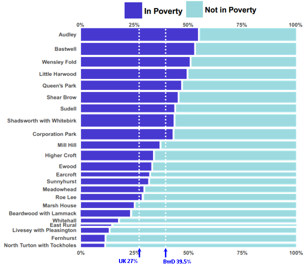
```

#### Effects of child poverty
```{block2, type = 'papers'}
##### What the papers say....
New research from the LSE _[@LSE2017]_ finds strong evidence that the poorer outcomes observed among children from low-income families are _not_ solely due to associated factors such as parental education. Household income _in itself_ is proven to be important for children’s physical health and social, behavioural and cognitive development.
&nbsp;
<div style="text-align: right;font-size:80%;"><em>[‘Newspaper’](https://thenounproject.com/term/newspaper/154015) icon by Loïc Poivet from [The Noun Project](https://thenounproject.com)</em></div>
```

### Education
#### Early Years Foundation Stage
The Early Years Foundation Stage profile measures children’s development at the end of the school year in which they turn 5. Figure \@ref(fig:EYchart) shows that in 2017, 66% of Blackburn with Darwen children were deemed to have a ‘good’ level of development, compared with 56% two years ago. It means that Blackburn with Darwen has risen from third lowest to joint 12th lowest place _[@DfE_early]_.

Within the borough, the inequality between White and Asian pupils has now disappeared. There continues to be a gap between those with and without English as their first language, but it is relatively small. Blackburn with Darwen’s Free School Meals (FSM) pupils still lag their non-FSM peers by 15 percentage points, although the borough’s ranking has improved. 

(ref:EYcap) Foundation Stage: percentage of children achieving a good level of development, 2017<br/><em>(overall, and broken down by ethnicity, first language, and Free School Meal status)</em>

```{r EYchart, fig.cap='(ref:EYcap)', echo=FALSE,out.width='80%', fig.align='center'}
knitr::include_graphics("Assets/p17fig33.png")
```

#### Primary Education - Key Stage 2
At the end of primary education, 60% of Blackburn with Darwen pupils in 2017 achieved the new more stringent ‘expected standard’ in reading, writing and mathematics (England 62%) _[@DfE_stage2]_. There is little difference, either locally or nationally, in the performance of White and Asian pupils, or those with or without English as their first language (Figure \@ref(fig:KS2chart)). Blackburn with Darwen children entitled to Free School Meals (FSM) still do less well than their non-FSM peers, although the gap is not as big as regionally or nationally. On the previous tests, the borough had the second best results outside London for FSM pupils, but that has now slipped to 12th best (or 41st place overall).

(ref:KS2cap) Key Stage 2: % achieving 'expected standard' in reading, writing and mathematics, 2017<br/><em>(overall, and broken down by ethnicity, first language, and Free School Meal status)</em>

```{r KS2chart, fig.cap='(ref:KS2cap)', echo=FALSE,out.width='80%', fig.align='center'}
knitr::include_graphics("Assets/p17fig34.png")
```

#### GCSE Attainment
The measurement of GCSE attainment becomes ever more complicated, and difficult to compare with previous years. Starting in 2017, English and Maths exams are now graded on a scale of 9 to 1 (where 9 is best). The simplest headline measure of attainment is the percentage of pupils obtaining grade 5 or better in both those subjects.

On this basis, Blackburn with Darwen’s overall score is 42% (Figure \@ref(fig:GCSEchart)), not far off the England average _[@DfE_GCSE]_.  The performance of its White pupils, however, is the 19th lowest out of 149 local authorities. It is striking how by this stage, Blackburn with Darwen pupils whose did _not_ have English as their first language are performing better than those who did. The borough’s results for Free School Meals (FSM) pupils may not seem impressive, but are actually very good compared with most other NW authorities.

(ref:GCSEcap) GCSE: % achieving Grade 5 or better in English & Maths, 2017<br/><em>(overall, and broken down by ethnicity, first language, and Free School Meal status)</em>

```{r GCSEchart, fig.cap='(ref:GCSEcap)', echo=FALSE,out.width='80%', fig.align='center'}
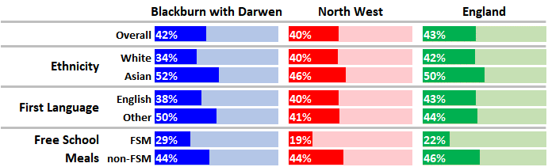
```

## Vulnerable Children\
and Young People

### Children in Need
**‘Children in Need’** is the DfE’s term for all those referred to the local authority and assessed to be in need of services. Blackburn with Darwen had a total of 1781 Children in Need at the end of March 2017, compared with 1617 two years previously. This equates to 464 per 10,000, against an average of 372 in the NW and 330 for England, putting Blackburn with Darwen just within the highest 20 authorities _[@DfE_Need]_.

Figure \@ref(fig:inNeedchart) shows the primary reason why these children were assessed as being in need. ‘Abuse or neglect’ outstrips other reasons by an even greater margin than in the previous Summary Review.

(ref:inNeedcap) Children in Need in Blackburn with Darwen<br/>by primary need at initial assessment (March 2017)

```{r inNeedchart, fig.cap='(ref:inNeedcap)', echo=FALSE,out.width='60%', fig.align='center'}
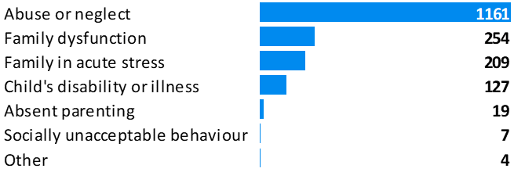
```

### Looked After Children
One category of ‘Children in Need’ is those looked after by the local authority. As at 31st March 2017, there were 370 Blackburn with Darwen children in local authority care, up from 315 two years previously. This equates to 96 per 10,000 children under the age of 18, which remains significantly higher than average (England rate 62 per 10,000), and places the borough in the top quintile nationally _[@PHE_vulnCYP]_.

### NEETs
Vulnerable young people are at particular risk of becoming **NEET _(Not in Education, Employment or Training)_**, which in turn can lead to increased risk of poor health, depression, early parenthood, and other negative outcomes. The figures are now collected in a new way, tracking only those aged 16 and 17. In 2016, Blackburn with Darwen was estimated to have 240 young people aged 16-17 in the NEET category, or 6.1% of the age-group, which is not significantly different from the England average of 6.0% _[@PHE_download]_.

### Special Educational Needs
As at January 2018, 5171 children in Blackburn with Darwen schools had a **Special Educational Need** (SEN), or 17.7% of all pupils. This is significantly higher than the average for England (14.6%) or the North West (14.8%) _[@DfE_SEN1]_.

Figure \@ref(fig:SENchart) shows the proportion of all pupils in the maintained sector having a Special Educational Need of each particular type _[@DfE_SEN2]_.  The rate of ‘Speech, Language and Communication Needs’ in Blackburn with Darwen is strikingly higher than average. The overall rate of SEN in the borough’s state-funded primary schools (19.5%) is the highest in the country _[@DfE_SEN2]_.

(ref:SENcap) Prevalence of particular types of Special Educational Need,<br/>January 2018 (maintained schools only, primary type of need only)

```{r SENchart, fig.cap='(ref:SENcap)', echo=FALSE,out.width='80%', fig.align='center'}
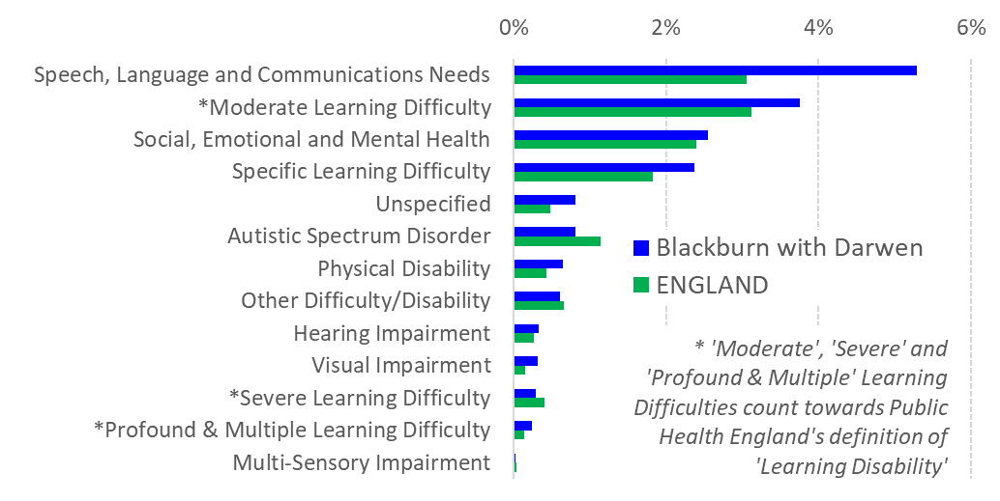
```

**‘Specific Learning Difficulty’** describes conditions such as dyslexia. The other three categories of learning difficulty, marked in Figure \@ref(fig:SENchart) with an asterisk, combine to form what Public Health England refers to as **‘learning disabilities’**. Based on the 2017 figures, PHE calculates that Blackburn with Darwen’s combined rate of learning disability known to schools was significantly higher than average, and it came sixth highest in England for ‘Profound & Multiple Learning Difficulty’ _[@PHE_LD]_.

## Lifestyle Factors
### Teenage Pregnancy
The number of under-18 conceptions in Blackburn with Darwen fell to a new low of 59 in 2016, in what was the lowest year nationally since records began _[@ONS_conception]_. Expressed as a rate, Blackburn with Darwen is not significantly different from the new lowest-ever England average.

```{r under18chart, fig.cap='Under-18 conception rate (per 1000 females aged 15-17)', echo = FALSE, out.width = '80%', fig.align='center'}
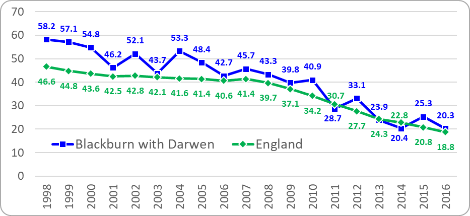
```

At the launch of the government’s Teenage Pregnancy Strategy in 1998, the borough had 169 under-18 conceptions. The reduction since then puts it in the second most improved quintile of upper-tier local authorities (Figure \@ref(fig:u18improvechart)):

(ref:u18improvecap) % change in under-18 conception rate between 1998 and 2016<br/><em>(upper tier local authorities)</em>

```{r u18improvechart, fig.cap='(ref:u18improvecap)', echo=FALSE,out.width='60%', fig.align='center'}
knitr::include_graphics("Assets/p19fig39.png")
```

Under-16 conceptions involve even smaller numbers, and ONS now combines them for three years. With 35 such conceptions in 2014-16, Blackburn with Darwen had a rate of 4.0 per 1000, which is very close to the England average (3.7 per 1000) and not significantly different from it _[@ONS_conception]_.

### Chlamydia Screening
Chlamydia is a largely hidden condition, so cases are most often discovered through opportunistic screening. The National Chlamydia Screening Programme aims to diagnose and treat as many cases as possible in young people, and local authorities are encouraged to aim for a ‘Chlamydia Detection Rate’ of at least 2300 per 100,000 15-24 year-olds.

Latest figures for 2017 _[@PHE_chlamydia]_ imply that Blackburn with Darwen’s detection rate is very close to that target, at 2263 per 100,000 (Figure \@ref(fig:chlamydiachart)). The apparent spectacular performance in 2016 is now thought to have been due to data collection issues. 

(ref:chlamydiacap) Chlamydia detection rate per 100,000<br/>(15-24 year-olds, 2012-2017)

```{r chlamydiachart, fig.cap='(ref:chlamydiacap)', echo=FALSE,out.width='60%', fig.align='center'}
knitr::include_graphics("Assets/p19fig40.png")
```

### Child Obesity and Underweight
```{block2, type = 'newstuff'}
This section contains updated material 
&nbsp;
<div style="text-align: right;font-size:80%;"><em>[‘Sparkling’](https://thenounproject.com/term/sparkling/1200272) icon by Morten Halvorsen from [The Noun Project](https://thenounproject.com)</em></div>
```
Figure \@ref(fig:NCMPchart) shows the results of the latest National Child Measurement Programme (NCMP) survey in 2017/18 _[@PHE_NCMP]_.  Most of Blackburn with Darwen’s results are fairly close to average, but that is no reason for complacency when over a third of children in Year 6 (both locally and nationally) are above a healthy weight.

```{r NCMPchart, fig.cap='_(interactive)_ National Child Measurement Programme 2017-18', echo = FALSE, message = FALSE, warning = FALSE,out.width = '100%', fig.align='center'}
# 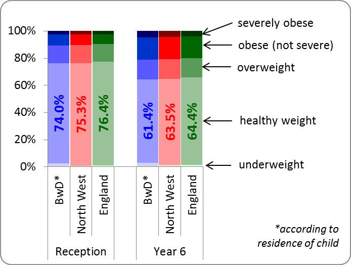
# Pull off latest data for underweight, healthy weight, overweight, obese (inc severely obese), severely obese, for Reception and Year 6
BwDData <- fingertips_data(IndicatorID = c(90316,90317,92464,90319,93194,90320,90321,92465,90323,93195),AreaTypeID = 102,AreaCode = "E06000008",ProfileID = 32,categorytype = TRUE) %>% 
  filter(is.na(CategoryType),Sex == "Persons",TimeperiodSortable == max(TimeperiodSortable))
NWData <- fingertips_data(IndicatorID = c(90316,90317,92464,90319,93194,90320,90321,92465,90323,93195),AreaTypeID = 6,AreaCode = "E12000002",ProfileID = 32,categorytype = TRUE) %>% 
  filter(is.na(CategoryType),Sex == "Persons",TimeperiodSortable == max(TimeperiodSortable)) 
EngData <- fingertips_data(IndicatorID = c(90316,90317,92464,90319,93194,90320,90321,92465,90323,93195),AreaTypeID = 102,AreaCode = "E92000001",ProfileID = 32,categorytype = TRUE) %>% 
  filter(is.na(CategoryType),Sex == "Persons",TimeperiodSortable == max(TimeperiodSortable)) 

allData <- bind_rows(BwDData,NWData,EngData)
latestyear <- max(allData$Timeperiod)
allData <- allData %>% mutate(IndicatorName = ifelse(substr(IndicatorName,1,6) == "Year 6",substring(IndicatorName,23),substring(IndicatorName,26))) %>%
  mutate(Area = ifelse(AreaName == "Blackburn with Darwen","BwD",ifelse(AreaName == "North West region","North West","England"))) %>%
  select(IndicatorName,Area,Age,Value)

allData <- allData %>% spread(IndicatorName,Value) %>% mutate(merelyobese = `obesity (including severe obesity)` - `severe obesity`)  %>%
  select(Area,Age,underweight,healthyweight = `healthy weight`,overweight,merelyobese,severelyobese = `severe obesity`) %>%
  gather("category","PC",3:7)

allData$category <- factor(allData$category, levels = c("underweight","healthyweight","overweight","merelyobese","severelyobese"))
allData <- allData %>% mutate(opacity = as.numeric(category)/5) 
pal <- c('blue','green','red')
allData <- allData %>% mutate(color = factor(Area,labels = pal)) %>%     
  mutate(colshade = paste(color,opacity)) %>% 
  mutate(colshade = factor(colshade)) %>%
  mutate(catlabel = category)

levels(allData$catlabel) <- list("Underweight" = "underweight","Healthy Weight" = "healthyweight","Overweight" = "overweight",
                                 "Obese\n(not severe)" = "merelyobese","Severely Obese" = "severelyobese")

# Palette is blue, green and red, each at five different transparencies (see https://gist.github.com/lopspower/03fb1cc0ac9f32ef38f4)

pal <- c("#0000FF33","#0000FF66","#0000FF99","#0000FFBF","#0000FFFF",
         "#008b0033","#008b0066","#008b0099","#008b00BF","#008b00FF",
         "#FF000033","#FF000066","#FF000099","#FF0000BF","#FF0000FF")

m <- list(
  l = 40,
  r = 170,
  b = 60,
  t = 80,
  pad = 4
)

reception <- allData %>% filter(Age == "4-5 yrs")

p1 <- plot_ly(reception) %>% 
  add_trace(type = "bar", x = ~Area, y = ~PC, color = ~colshade, colors = pal,
            text = ~ paste(catlabel,": ",round(PC,1),"%"),hoverinfo = "text") %>%  
  layout(barmode = "stack",
         xaxis = list(title = "",tickangle = 90,showline = FALSE,tickfont = list(size = 20)),
         yaxis = list(title = "",tickfont = list(size = 20), range = c(0,100)),
         showlegend = FALSE,hovermode = "compare") %>%
  add_annotations(
    x=0.5,
    y=1.05,
    xref = "paper",
    yref = "paper",
    text = "Reception",
    xanchor = "center",
    yanchor = "bottom",
    showarrow = F,
    font = list(size=30, face="bold")
  ) %>%
  add_annotations(
    x= ~ ifelse(Area == "BwD",1,ifelse(Area == "England",3,5))/6,
    y= ~ PC/2,
    xref = "paper",
    yref = "y",
    xanchor = 'center',yanchor = 'center',
    text = ~ ifelse(catlabel == "Healthy Weight",paste0("<b>Healthy\nWeight\n",round(PC,1),"%</b>"),""),
    showarrow = F,
    font = list(size=14, face="bold", color = "white")
  )

year6 <- allData %>% filter(Age == "10-11 yrs")

p2 <- plot_ly(year6) %>% 
  add_trace(type = "bar", x = ~Area, y = ~PC, color = ~colshade, colors = pal,
            text = ~ paste(catlabel,": ",round(PC,1),"%"),hoverinfo = "text") %>%  
  layout(barmode = "stack",
         xaxis = list(title = "",tickangle = 90,showline = FALSE,tickfont = list(size = 20)),
         yaxis = list(title = "",tickfont = list(size = 20), range = c(0,100)),
         showlegend = FALSE,hovermode = "compare") %>%
  add_annotations(
    x=0.5,
    y=1.05,
    xref = "paper",
    yref = "paper",
    text = "Year 6",
    xanchor = "center",
    yanchor = "bottom",
    showarrow = F,
    font = list(size=30, face="bold")
  ) %>%
  add_annotations(
    x= ~ ifelse(Area == "BwD",1,ifelse(Area == "England",3,5))/6,
    y= ~ PC/2,
    xref = "paper",
    yref = "y",
    xanchor = 'center',yanchor = 'center',
    text = ~ ifelse(catlabel == "Healthy Weight",paste0("<b>Healthy\nWeight\n",round(PC,1),"%</b>"),""),
    showarrow = F,
    font = list(size=14, face="bold", color = "white")
  )

p <- subplot(p1,p2,shareY = TRUE,shareX = FALSE) %>% layout(margin = m)
p
```

#### Underweight children
The only statistic which is significantly different from average - and in fact the highest in the country - is the proportion of Year 6 children who are _underweight_ (Blackburn with Darwen 3.0%, England 1.4%). However, in Reception, the local rate of 1.45 is is no longer significantly higher than the England average (1.4%). It should be noted that nationally, pupils of Asian heritage are much more likely than average to be underweight.

#### Inequalities
Figure \@ref(fig:NCMPmap) shows that there are marked spatial inequalities in ‘excess weight’ (i.e. ‘overweight’ upwards) across Blackburn with Darwen:

```{r echo = FALSE, warning = FALSE, message = FALSE,results = 'hide'}
# Pull off latest Reception and Year 6 data for Excess Weight (3-year averages)
MSOAData <- fingertips_data(IndicatorID = c(93106, 93108),AreaCode = c("E02002615","E02002616","E02002617","E02002618","E02002619","E02002620","E02002621","E02002622","E02002623","E02002624","E02002625","E02002626","E02002627","E02002628","E02002629","E02002630","E02002631","E02002632"),
                            AreaTypeID = 3,categorytype = TRUE) %>% 
  filter(is.na(CategoryType),Sex == "Persons",TimeperiodSortable == max(TimeperiodSortable))

latestDate <- unique(MSOAData$Timeperiod)
lowest <- min(MSOAData$Value)
highest <- max(MSOAData$Value)

reception <- MSOAData %>% filter(Age == "4-5 yrs")
year6 <- MSOAData %>% filter(Age == "10-11 yrs")

MSOAs <- st_read("F:/R Programming/Misc work/MSOA DFLE and HLE/MSOA Blackburn_region.shp")
MSOAreception <- MSOAs %>% left_join(reception, by = c("MSOA_CODE" = "AreaCode"))
MSOAyear6 <- MSOAs %>% left_join(year6, by = c("MSOA_CODE" = "AreaCode"))
MSOAall <- MSOAs %>% left_join(MSOAData,by = c("MSOA_CODE" = "AreaCode"))
```

```{r NCMPmap, fig.cap='_(interactive)_ Prevalence of Excess Weight, 2015/16 - 2017/18', echo = FALSE, out.width = '100%', fig.align='center'}
#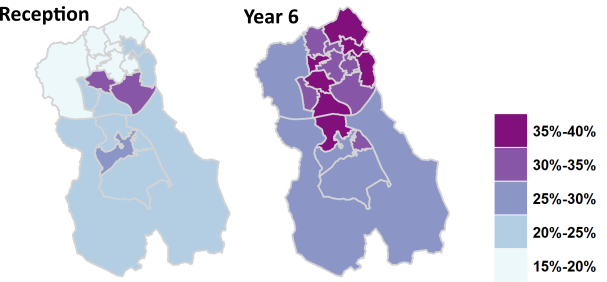
#### Excess Weight

# Trying plotly with a discrete scale. (Couldn't persuade it to use the SAME scale for both maps if continuous)
# NB - still no legend - couldn't fathom out how to display the sort of legend we would want. Using annotation as a workaround.

m <- list(
  l = 40,
  r = 150,
  b = 40,
  t = 80,
  pad = 4
)

mylabels <- c("10%-15%","15%-20%","20%-25%","25%-30%","30%-35%","35%-40%")
MSOAreception$shadecat <- cut(MSOAreception$Value,breaks=c(10,15,20,25,30,35,40),labels = mylabels)
MSOAyear6$shadecat <- cut(MSOAyear6$Value,breaks=c(10,15,20,25,30,35,40),labels = mylabels)

p1 <- plot_ly(MSOAreception,split = ~MSOA_CODE,
              line = list(width = 1, color = "lightgray"),
              color = ~shadecat,colors = "YlGnBu",alpha = 1,
              hoveron = "fills",hoverinfo="text",type = "scatter",mode = "lines",
              text = ~paste("MSOA: ",MSOA_CODE,"\nChildren (3yrs combined): <b>",Count,"</b>\nExcess weight: <b>",round(Value,1),"%</b>")) %>%
  #colorbar(title= "Excess Weight",tickfont = list(size = 18),titlefont = list(size = 20),ticksuffix = "%",
  #         lenmode = "fraction",len = 0.8) %>%
  hide_legend() %>%
  layout(margin = m) %>%
  add_annotations(
    x=0.5,
    y=1.0,
    xref = "paper",
    yref = "paper",
    text = "Reception",
    xanchor = "center",
    yanchor = "bottom",
    showarrow = F,
    font = list(size=30, face="bold")
  ) 

p2 <- plot_ly(MSOAyear6,split = ~MSOA_CODE,
              line = list(width = 1, color = "lightgray"),
              color = ~shadecat,colors = "YlGnBu",alpha = 1,
              hoveron = "fills",hoverinfo="text",type = "scatter",mode = "lines",
              text = ~paste("MSOA: ",MSOA_CODE,"\nChildren (3yrs combined): <b>",Count,"</b>\nExcess weight: <b>",round(Value,1),"%</b>")) %>%
  hide_legend() %>%
  layout(margin = m) %>%
  add_annotations(
    x=0.5,
    y=1.0,
    xref = "paper",
    yref = "paper",
    text = "Year 6",
    xanchor = "center",
    yanchor = "bottom",
    showarrow = F,
    font = list(size=30, face="bold")
  ) %>%
  add_annotations(
    x=0.8,y=1,
    xref = "paper",yref = "paper",
    text = paste0(sprintf("<span style = 'color: #253494;text-shadow: 2px 2px 0px #bdbdbd'><b>%s</b></span>","35%-40%"),"\n",
                  sprintf("<span style = 'color: #2c7fb8;text-shadow: 2px 2px 0px #bdbdbd'><b>%s</b></span>","30%-35%"),"\n",
                  sprintf("<span style = 'color: #41b6c4;text-shadow: 2px 2px 0px #bdbdbd'><b>%s</b></span>","25%-30%"),"\n",
                  sprintf("<span style = 'color: #7fcdbb;text-shadow: 2px 2px 0px #bdbdbd'><b>%s</b></span>","20%-25%"),"\n",
                  sprintf("<span style = 'color: #c7e9b4;text-shadow: 2px 2px 0px #bdbdbd'><b>%s</b></span>","15%-20%"),"\n",
                  sprintf("<span style = 'color: #ffffcc;text-shadow: 2px 2px 0px #bdbdbd'><b>%s</b></span>","10%-15%")),
    xanchor = "left",
    yanchor = "top",
    showarrow = F,
    font = list(size = 25, face = "bold")
  )

p <- subplot(p1,p2,shareY = TRUE,shareX = FALSE) %>% 
  layout(margin = m)
p

```

Public Health England has also looked at obesity alone, for five years combined (2013/14-2017/18), to see how it varies with deprivation. In most local authorities, including Blackburn with Darwen, they found a strong tendency for obesity to be highest in the most deprived quintile and lowest in the least deprived _[@PHE_NCMP]_.

### Children's Oral Health
#### Dental health of 5-year olds
In the previous (2015) survey of 5-year olds’ dental health _[@PHE_dentalsurvey]_, Blackburn with Darwen had 56% of children with one or more decayed, missing or filled teeth, which was the highest proportion in England.The latest (2017) survey shows a generally improved picture, with this proportion falling to 42.6% in Blackburn with Darwen versus 23.3% in England _[@PHE_dentaldecline]_. Blackburn with Darwen is now 4th or 7th highest, depending whether we compare with other upper- or lower-tier authorities. All the other worst-affected authorities are also in the North West.

#### Hospital admissions for tooth extraction
In 2016/17, there were 371 admissions of Blackburn with Darwen children to have teeth out because of dental caries, up from 337 the year before. This represents a higher than average proportion of the population in every age-group, particularly those aged 5-9 (Figure \@ref(fig:teethchart)) _[@PHE_extractions]_.  Across the country, many children also have teeth extracted in primary care _[@BDA_2016]_. 

(ref:teethcap) Hospital admissions for tooth extraction 2016/17<br/>(with caries as primary diagnosis, as % of age-group)

```{r teethchart, fig.cap='(ref:teethcap)', echo=FALSE,out.width='60%', fig.align='center'}
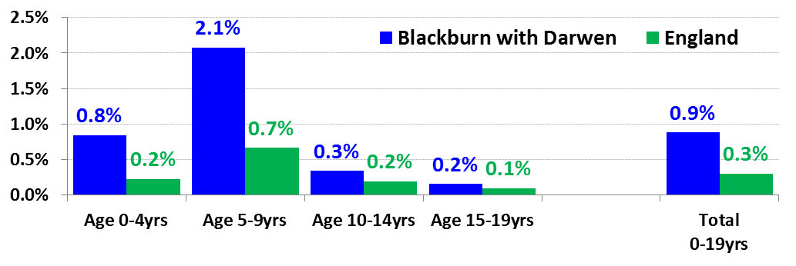
```

#### Child attendance at NHS dentists
One encouraging statistic is that 68.1% of Blackburn with Darwen children saw an NHS dentist in the 12 months to March 2018, compared with only 58.4% nationally _[@DailyMail; @NHSDig_dental]_.

## Road Accidents
### Children Killed or \
Seriously Injured (KSI)
According to police figures, 43 children aged 0-15 were killed or seriously injured (KSI) on Blackburn with Darwen’s roads in the three years from 2015 to 2017 (see Figure \@ref(fig:KSImap) for locations). This total included one child fatality in 2016, the first since 2006. The borough now has the highest crude child KSI rate of any upper-tier local authority in England _[@PHE_childhealth]_. This is despite the fact that in 2016, many other police forces (_not_ including Lancashire) introduced new reporting systems which more readily classify injuries as ‘serious’ _[@DfT_roadcas]_. 

(ref:KSImapcap) Children (0-15) Killed or Seriously Injured (KSI)<br/>in Blackburn with Darwen 2015-17<br/><em>(showing ward boundaries)</em>

```{r KSImap, fig.cap='(ref:KSImapcap)', echo=FALSE,out.width='60%', fig.align='center'}
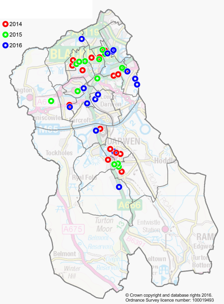
```

Figure \@ref(fig:KSImosaic) looks at all young people killed or seriously injured up to the age of 25, over a five-year period (2013-17). The casualties are broken down by type of road user (columns) as well as by age (light to dark shading). There were three fatalities: a child pedestrian, and a motor-cyclist and a car occupant both aged 21-25. All the other casualties were serious injuries. Over 40% were pedestrians, of whom almost half were under 11 _[@DfT_Stats19]_. 

(ref:KSImosaiccap) Breakdown of 162 KSI casualties aged 0-25<br/>by age & road-user type (BwD, 2013-17)

```{r KSImosaic, fig.cap='(ref:KSImosaiccap)', echo=FALSE,out.width='60%', fig.align='center'}
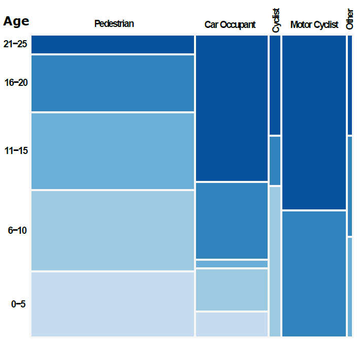
```

#### Pedestrian Child KSI
The borough’s rate of pedestrian KSI casualties among children and young people is well above the national average (Figure \@ref(fig:pedKSIchart)), particularly under the age of 16 _[@DfT_Stats19]_. In 2012/13-16/17, it also had the highest rate of emergency admissions for pedestrian casualties aged 0-24 _[@PHE_childhealth]_.

(ref:pedKSIcap) Pedestrian KSI rate per 100,000 children/young people<br/>(BwD v. England, 2013-17)</br><em>showing 95% confidence intervals</em>

```{r pedKSIchart, fig.cap='(ref:pedKSIcap)', echo=FALSE,out.width='60%', fig.align='center'}
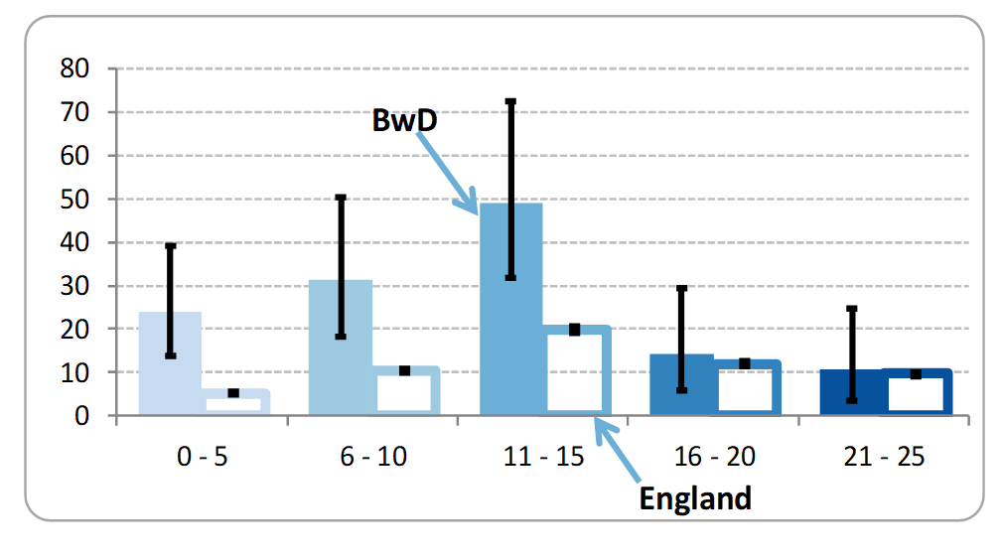
```

### All Child Road Casualties
If we broaden our scope to include *all* recorded child casualties on the road, whether serious or not, Blackburn with Darwen still compares badly. When we add up the total number of casualties aged 0-15 during the years 2013 to 2017, and express it as a crude rate (relative to the 0-15 year-old resident population), the borough ranks 4th highest out of 152 upper-tier authorities in England _[@DfT_casualties]_. 

## Child Health Outcomes
Figure \@ref(fig:childchart) shows how Blackburn with Darwen compares with England at various ages, on a cross-section of key outcomes _[@PHE_childhealth]_:

```{r childchart, fig.cap='Key child health outcomes', echo = FALSE, out.width = '100%', fig.align='center'}
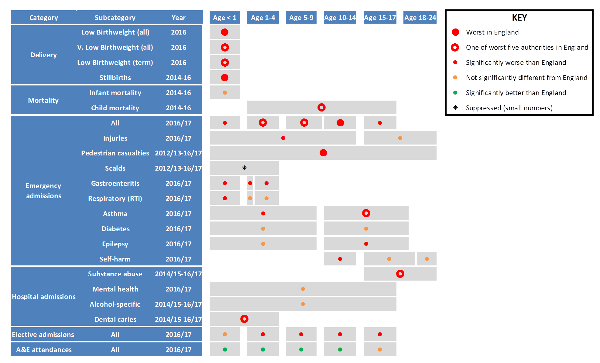
```

### At delivery
Blackburn with Darwen has some of the highest rates of low birthweight nationally, whether measured for all babies or those born at term. It also experienced 50 stillbirths over the three years 2014-16, which gave it the highest rate of any upper-tier authority. Comparative figures for 2015-17 are not yet available, but the borough had 12 stillbirths in 2017, which is at least a step in the right direction _[@ONS_births]_. 

```{block2, type = 'greybox'}
#### NHS action on stillbirths
It is the NHS’s ambition to halve the national stillbirth rate by 2025 (compared to 2013/14) _[@DH_stillbirths]_. An initiative called the Saving Babies Lives Care Bundle, piloted in 19 maternity units, has been shown to have the potential to save 600 stillbirths a year nationally _[@NHSEng_stillbirths]_.  The evaluation does, by Manchester University, does however caution: 
  
<strong><em>‘Socioeconomic factors remain important contributors to stillbirth, and without parallel initiatives to address inequality, healthcare interventions can only have limited impact.’</em></strong> _[@MU_stillbirths]_
```

### Infant and Child Mortality
Infant mortality (i.e. death under the age of one), and child death (aged 1-17) both involve very small numbers, with 32 and 21 occurrences respectively in Blackburn with Darwen over a three-year period. The resulting infant mortality rate is not significantly different from the England average, but the borough’s child mortality rate is the fourth highest in the country.

### Hospital Admissions\
and Attendances
The remainder of Figure \@ref(fig:childchart) focuses on hospital admissions or attendances by Blackburn with Darwen children of various ages. Overall, the borough has significantly higher than average emergency admissions at all stages of childhood, and comes highest in the country for age 10-14. It is the top upper-tier authority for child admissions due to pedestrian casualties, second highest for asthma in the 10-17 age-group, and also ranks in the top five for substance misuse and dental caries (i.e. hospital admissions for tooth extraction). Given all this, its rate of child A&E attendances is perhaps surprisingly low.
