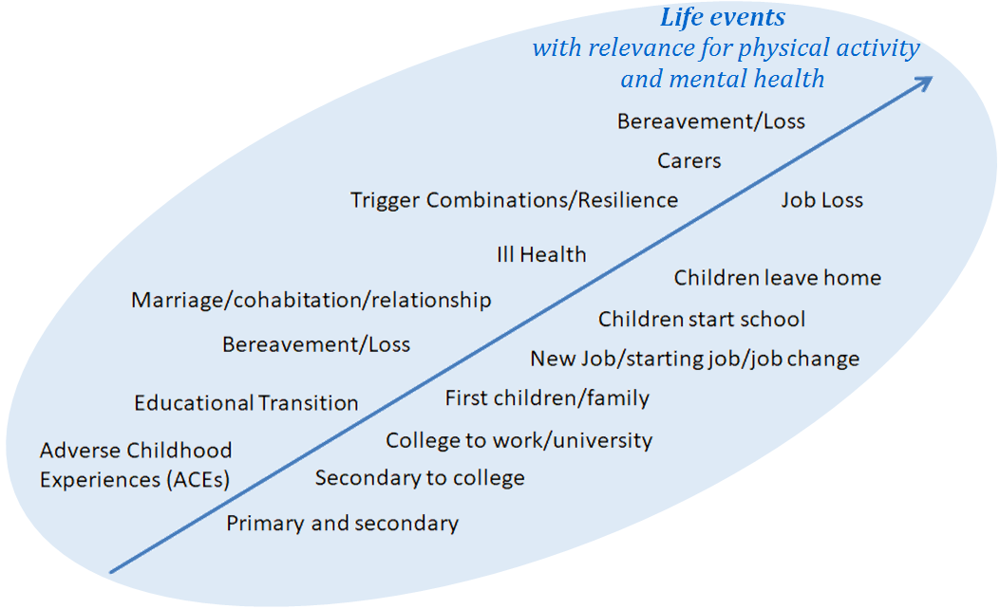
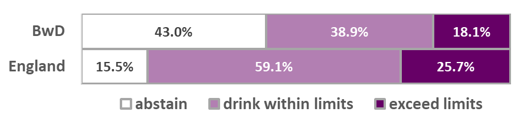
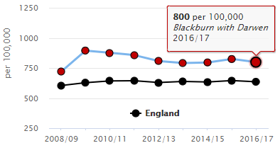
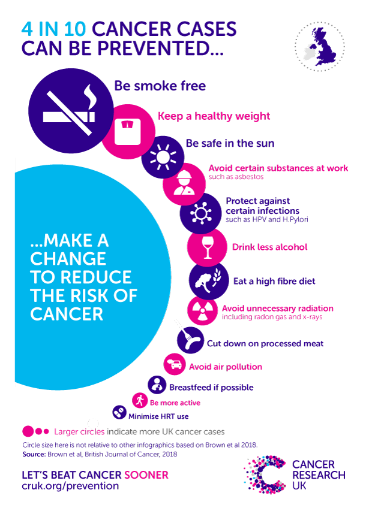
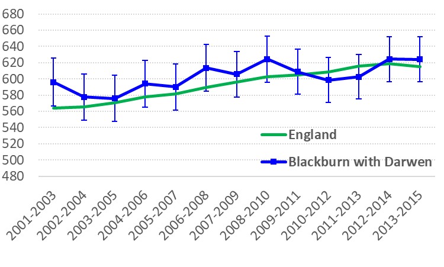

# Live Well
## Lifestyle Factors
### Obesity and Healthy Eating
```{r strategybanner, echo = FALSE, out.width = '90%', fig.align='center'}

```

‘Eat Well Move More Shape Up’ is Blackburn with Darwen’s 2017-2020 strategy to make physical activity and healthy eating an easy choice for all _[@BwD_EatWell]_.

```{block2, type = 'scales'}
#### Adult obesity
In 2016/17, an estimated 66.4% of Blackburn with Darwen adults were overweight or obese _[@PHE_physical]_. This is significantly higher than the England average of 61.3%, which of course is far from ideal in itself. Given that they are based on survey responses, these estimates may well be understating the size of the problem _[@PHE_physical]_.
&nbsp;
<div style="text-align: right; font-size:80%;"><em>[‘Weight Scale’](https://thenounproject.com/search/?q=obesity&i=1695893) icon by Semmel Zenko from [The Noun Project](https://thenounproject.com)</em></div>
```
&nbsp;

Public Health England estimates that obesity reduces life expectancy by an average of three years, and severe obesity by 8-10 years _[@PHE_adultobese]_. It has produced an infographic summary of the many ways in which obesity can harm health (Figure \@ref(fig:obinfographic)).

```{r obinfographic, fig.cap='"Obesity harms health"', echo = FALSE, out.width = '90%', fig.align='center'}
knitr::include_graphics("Assets/p23fig48.png")
```

New data from NHS Digital (Figure \@ref(fig:obadmitchart)) shows that Blackburn with Darwen has a rapidly rising rate of hospital admissions where obesity was listed as a factor (though not necessarily the main reason). 

(ref:obadmitcap) Hospital admissions with a primary or secondary diagnosis of obesity<br/>(age-standardised rate, all ages)

```{r obadmitchart, fig.cap='(ref:obadmitcap)', echo=FALSE,out.width='60%', fig.align='center'}
knitr::include_graphics("Assets/p23fig49.png")
```

The rise over time may be partly due to an increasing tendency to record ‘obesity’ when logging admissions, but it means that in 2016/17, Blackburn with Darwen comes 13th highest out of 152 upper-tier authorities _[@NHSDig_obesityetc]_. 

```{block2, type = 'fruit'}
#### Diet
58.5% of adults in Blackburn with Darwen claimed to achieve the recommended ‘5-a-day’ portions of fruit and vegetables in 2016/17, which is similar to the England average of 57.4%. Fruit consumption is close to average, but intake of vegetables in Blackburn with Darwen (2.55 portions per day) is significantly lower than the England average (2.70 portions) _[@PHE_PHOF]_.
&nbsp;
<div style="text-align: right; font-size:80%;"><em>[‘Fruit’](https://thenounproject.com/search/?q=fruit&i=1280962) icon by Eucalypt from [The Noun Project](https://thenounproject.com)</em></div>
```

```{block2, type = 'healthyweight'}
#### Declaration on Healthy Weight
The Local Authority Declaration on Healthy Weight, signed in April 2017 by Blackburn with Darwen Borough Council and Blackburn with Darwen CCG, is the first of its kind in the country _[@BwD_EatWellYr1; @BwD_declaration]_. Taking a ‘whole systems’ approach, it contains a range of commitments designed to promote healthy weight and improve the health and wellbeing of the local population.
```

### Physical Activity
#### Levels of Activity
Public Health England considers us ‘physically active’ if we do the equivalent of 150+ minutes of moderate intensity sporting or fitness activities per week, in bouts of at least 10 minutes. Below 30 minutes is ‘inactive’. With 60.1% of adults ‘active’ and 26.2% ‘inactive’, Blackburn with Darwen is significantly worse than England on both counts (Figure \@ref(fig:physactchart)) _[@PHE_physical]_.

```{r physactchart, fig.cap='Physical Activity in Adults, 2016/17', echo = FALSE, out.width = '60%', fig.align='center'}
knitr::include_graphics("Assets/p24fig50.png")
```

```{block2, type = 'weavers'}
#### Walking and Cycling
In 2016/17, only 67.0% of Blackburn with Darwen adults walked for over 10 continuous minutes, for 
any purpose, at least once a month (England average 78.4%). This was the lowest proportion out of 326 lower-tier authorities. Blackburn with Darwen is still the lowest if we say ‘walked or cycled’, with only 68.1% doing either at least monthly (England 80.0%) _[@DfT_walking]_.  
```

#### Health Benefits
A growing body of evidence testifies to the importance of physical activity for general health:

(ref:healthbencap) Benefits of Physical Activity<br/><em>according to the UK's four Chief Medical Officers [@DH_active]</em>

```{r healthbenchart, fig.cap='(ref:healthbencap)', echo=FALSE,out.width='60%', fig.align='center'}

```
```{block2, type = 'papers'}
##### What the papers say....
Research led by King’s College London has found that those who meet the NHS’s ‘150 minutes per week’ physical activity guidelines are 31% less likely to develop depression than those who do not _[@DailyTel; @KCL2017]_. 

This adds to the growing body of evidence that exercise can help to reduce the risk of diabetes, various cancers, hip fractures and cardiovascular disease, improve the health of those who already have chronic disease, and enable older people to remain independent for longer _[@AMRC2015; @RCS2017]_. The Academy of Medical Royal Colleges goes so far as to call it the ‘Miracle Cure’ _[@AMRC2015]_, and PHE has published advice for health professionals on how to persuade patients of its benefits _[@PHE_physicalAOH]_.

&nbsp;
<div style="text-align: right;font-size:80%;"><em>[‘Newspaper’](https://thenounproject.com/term/newspaper/154015) icon by Loïc Poivet from [The Noun Project](https://thenounproject.com)</em></div>
```

#### Physical Activity in Pennine Lancashire
In recognition of these benefits, Sport England invited bids in 2017 for 12 National Lottery-funded **Local Delivery Pilot** areas. Pennine Lancashire (which includes Blackburn with Darwen) was one of the successful bidders.

##### Together an Active Future
The Sport England project in Pennine Lancashire, known as **Together an Active Future** _[@TAAF]_, aims to reach out to the many local people who are physically inactive, experiencing poor mental wellbeing, or both. It particularly seeks to harness the benefits of physical activity for mental health, and as a response to stressful life events (Figure \@ref(fig:lifecoursechart)).

(ref:lifecoursecap) Lifecourse Transition Model<br/>from <em><strong>Together an Active Future</strong></em>

```{r lifecoursechart, fig.cap='(ref:lifecoursecap)', echo=FALSE,out.width='90%', fig.align='center'}

```

One of the main objectives is to improve our understanding of _why_ people are not more active. Creative engagement techniques, including a ‘Life Course Reflection Tool’, are used to explore how each person’s attitudes and experiences at different ages may have shaped the way they relate to physical activity now _[@TAHF]_.  These conversations have also uncovered a lack of awareness of the physical activity offers that already exist.

For their part, many service providers are unsure how to approach those who are less active, so they welcome the opportunity to talk,think and work together to bring change.

### Alcohol (Adults)
#### Alcohol Consumption
The most recent estimates of alcohol consumption are for 2011-14. They suggest that 43% of adults in Blackburn with Darwen abstain from alcohol altogether (Figure \@ref(fig:consumpchart)), which is the 5th highest proportion in England. Only 18.1% are estimated to exceed the recommended limit of 14 units per week (England 25.7%), putting the borough in the lowest quintile. Binge drinking rates (not shown) are significantly lower than average at 8.2% (England 16.5%) _[@PHE_alcprofile]_. 

(ref:consumpcap) Estimated Alcohol Consumption 2011-14<br/>(Blackburn with Darwen v. England)

```{r consumpchart, fig.cap='(ref:consumpcap)', echo=FALSE,out.width='60%', fig.align='center'}

```

#### The Alcohol Harm Paradox
Given all of the above, it might be assumed that Blackburn with Darwen would have relatively low levels of alcohol-related ill-health. However, it has been known for some time that although deprived populations may _drink less_ than more affluent groups, they are likely to suffer _greater harm_ as a consequence _[@Marmot]_.  Research into this ‘Alcohol Harm Paradox’ suggests that any given level of alcohol consumption is likely to do more damage to those who also smoke, are overweight or have an unhealthy lifestyle _[@Bellis]_.

#### Hospital Admissions
##### Alcohol-Related
A headline indicator of the health consequences of drinking is the rate of alcohol-related hospital admissions (weighted according to whether the patient’s condition is wholly or partly attributable to alcohol). ^[Rates described as ‘narrow’ are based on the primary reason for admission only. Those described as ‘broad’ include admissions where the relevant condition was a secondary diagnosis.] Blackburn with Darwen’s rate has been consistently higher than England for several years (Figure \@ref(fig:alcrelchart)). This is largely a male problem, as the borough’s female rate is close to average _[@PHE_alcprofile]_.

(ref:alcrelcap) Rate of alcohol-related admission episodes per 100,000 population<br/>('narrow' measure)

```{r alcrelchart, fig.cap='(ref:alcrelcap)', echo=FALSE,out.width='60%', fig.align='center'}

```

Blackburn with Darwen’s admission rate for alcohol-related circulatory conditions is the second highest in England. Its admission rate for alcoholic liver disease has risen steeply, and is now the highest in the whole country (Figure \@ref(fig:alclivchart)) _[@PHE_alcprofile]_.

(ref:alclivcap) Rate of admission episodes for alcoholic liver disease per 100,000 population<br/>('broad' measure)

```{r alclivchart, fig.cap='(ref:alclivcap)', echo=FALSE,out.width='60%', fig.align='center'}

```

##### Alcohol-Specific
In 2016/17, Blackburn with Darwen had the 7th highest admission rate for alcohol-specific conditions (i.e. those which are invariably due to alcohol) _[@PHE_alcprofile]_. An analysis of the 2015/16 figures shows that in Blackburn with Darwen, the crude rate of patients being admitted for alcohol-specific conditions for the 3rd or subsequent time in 24 months was more than twice the national average. These repeat admissions may suggest a lack of effective contact with treatment services _[@PHE_alcpack]_.

#### Alcohol-related mortality
Blackburn with Darwen’s alcohol-related mortality rate in 2016 was significantly higher than average. Its 2014-16 death rate from chronic liver disease stands out as being the fourth worst in the country overall, and the second worst for females _[@PHE_alcprofile]_.

#### Alcohol-related incapacity
In 2016, Blackburn with Darwen had 300 claimants of incapacity benefits (mainly Employment & Support Allowance) whose main disabling condition was Alcohol Misuse. This equates to 334.4 per 100,000 people of working age, which puts it third highest out of 326 lower-tier districts (after Blackpool and Burnley) _[@PHE_alcprofile]_.

#### Treatment Services
In 2016, 182 people successfully completed alcohol treatment in Blackburn with Darwen and did not re-present within 6 months. As a proportion of all those in treatment, this equates to a 53.8% success rate, which makes Blackburn with Darwen the 9th best performing authority in the country (England average 38.7%) _[@PHE_alcprofile]_. PHE has estimated that the 2016-17 investment in treatment for alcohol-only clients in Blackburn with Darwen has brought social and economic benefits totalling £317,361 _[@PHE_alcpack]_.

### Smoking (Adults)
#### Prevalence
Latest estimates show that approximately 16.7% of adults in Blackburn with Darwen were current smokers in 2017 _[@PHE_tobacco]_.  This is no longer significantly higher than average (see light bars in Figure \@ref(fig:smokprevchart)). 

Smoking rates tend to be higher in the ‘Routine & Manual’ (R&M) group (dark bars in Figure \@ref(fig:smokprevchart)) than in the general population _[@ONS_smoking]_. They are also higher among males than females (not shown).

(ref:smokprevcap) Estimated smoking prevalence for adults aged 18+<br/>(showing 95% confidence intervals)<br/><em>Source: Annual Population Survey (via Tobacco Control Profiles)</em>

```{r smokprevchart, fig.cap='(ref:smokprevcap)', echo=FALSE,out.width='60%', fig.align='center'}

```

```{block2, type = 'TFL'}
##### Ambitions
In its Tobacco Control Plan for England _[@DH_smokefree]_, the Department of Health aims to get several smoking rates down to substantially lower levels by the end of 2022 (Figure \@ref(fig:smoktargetchart)). The **Tobacco Free Lancashire** strategy pledges to match these ambitions across Lancashire, incluing Blackburn with Darwen _[@TFL_smokefree]_. 
```

```{r smoktargetchart, fig.cap='Targets for 2022 (compared with latest figures)', echo = FALSE, out.width = '60%', fig.align='center'}
knitr::include_graphics("Assets/p26fig57.png")
```

To achieve this, it will need to heed the words of Duncan Selbie, Chief Executive of Public Health England _[@Gdn_tobacco]_:

>“the war on tobacco … will only be won if we make more progress in helping people from deprived areas and people suffering from poor mental health, where we know smoking rates remain stubbornly high.”

#### Outcomes
Blackburn with Darwen had approximately 250 smoking-attributable deaths each year during 2014-16, and was in the worst quintile for eight out of the nine mortality indicators in PHE’s Local Tobacco Control Profile. The borough was also in the top quintile in 2016/17 for smoking-attributable hospital admissions.

#### Costs
Latest estimates from ASH put the cost to society of smoking in Blackburn with Darwen at £34.2m. This may be a slight over-statement, as it is based on the 2016 prevalence of 19.5% (rather than 16.7%). The biggest element is lost productivity (£22.1m), followed by costs to the NHS, cost of social care, and cost of fires _[@ASH]_.

Public Health England has calculated that Blackburn with Darwen is in the highest quintile for the cost per head of smoking-attributable hospital admissions _[@PHE_invest]_.

#### Stop Smoking Services
Usage of ‘Stop Smoking’ services continues to decline, both locally and nationally. In 2017/18, 1287 Blackburn with Darwen clients set a quit date, of whom 425 (or 33%) had quit at four-week follow-up (England average 51%) _[@NHSDig_smoking]_.  Figure \@ref(fig:smokquitchart) shows the number of ‘setters’, and their success or failure, broken down by ethnic group and by socio-economic group.

(ref:smokquitcap) Blackburn with Darwen 'Stop Smoking' services 2017/18;<br/>'Setters' by ethnic group and socio-economic group,<br/>showing whether or not they managed to quit <em>[@PHE_invest]</em>

```{r smokquitchart, fig.cap='(ref:smokquitcap)', echo=FALSE,out.width='80%', fig.align='center'}
knitr::include_graphics("Assets/p26fig58.png")
```

‘Quitters’ divided by ‘setters’ is not, however, the only way of measuring success. When compared to the number of smokers in its _population_, Blackburn with Darwen’s 425 quitters actually represent a _better_ than average quit rate _[@NHSDig_smoking]_.

### Drug Misuse (Adults)
#### Prevalence
New estimates of the prevalence of opiate and/or crack cocaine use (OCU) were issued in 2017, relating to the year 2014/15 _[@PHE_opiates]_. Blackburn with Darwen had an estimated 1363 OCU users in all (Figure \@ref(fig:OCUchart) and Figure \@ref(fig:OCUtrendchart)). This gives it a rate of 14.47 per 1000 population, significantly higher than the England average of 8.57. 

(ref:OCUcap) Estimated users of Opiates and/or Crack,<br/>Blackburn with Darwen 2014/15 <em>_[@PHE_opiates]_</em>

```{r OCUchart, fig.cap='(ref:OCUcap)', echo=FALSE,out.width='45%', fig.align='center'}

```

The overall change since 2011/12 is only slight (Figure \@ref(fig:OCUtrendchart)). However, there _has_ been a significant fall in users aged 25-34, and a corresponding rise in those aged 35+.

```{r OCUtrendchart, fig.cap='Estimated OCU users by age (Blackburn with Darwen)', echo = FALSE, out.width = '55%', fig.align='center'}
knitr::include_graphics("Assets/p27fig60.png")
```

#### Drug-related Deaths
ONS figures for heroin and morphine-misuse deaths in 2014-16 show that many of the highest rates (brown hexagons in Figure \@ref(fig:heroinmap) are in seaside locations. However, Blackburn with Darwen, Burnley and Hyndburn all rank in the top 10 in England, and form a distinctive inland cluster of unusually high rates _[@ONS_heroin]_. 

(ref:heroincap) Rates of heroin and morphine deaths by misuse<br/>(Blackburn with Darwen 2014/15)2014-16, districts in England & Wales)

```{r heroinmap, fig.cap='(ref:heroincap)', echo=FALSE,out.width='60%', fig.align='center'}
knitr::include_graphics("Assets/p27fig61.png")
```

More generally, in the three-year period 2015-17, there were 46 deaths in Blackburn with Darwen from drug poisoning (involving legal or illegal drugs), of which 37 are classed as drug misuse (i.e. involving illegal drugs). The resulting drug poisoning and drug misuse death rates are both significantly higher than the England average, and in the top quintile of local authorities nationally _[@ONS_drugdeaths]_.  

With high drug mortality rates across Blackpool, Blackburn with Darwen and parts of Lancashire, a pan-Lancashire multiagency preventable harms group has been set up to share best practice _[@LGA_drugdeaths]_. 

#### Hospital Admissions
Among upper-tier local authorities in 2016/17, Blackburn with Darwen had the 4th highest admission rate where the primary diagnosis was a drug-related mental health or behavioural disorder, and the 6th highest where it was poisoning by illicit drugs _[@NHSDig_drugs]_.

#### Treatment
Treatment activity among both opiate and non-opiate users in Blackburn with Darwen rose in 2016-17 compared with the year before, as did the number of successful completions _[@PHE_drugpack]_. The borough’s success rate for both groups is in the top twelve nationally _[@PHE_cooccur]_.  Furthermore, it is estimated that those receiving treatment in Blackburn with Darwen committed 1000’s fewer crimes than they would otherwise have done. This alone delivered local social and economic cost savings of over £9.5m in just one year _[@PHE_drugpack]_.

```{block2, type = 'everybody'}
The vast majority of those presenting for treatment are White British _[@PHE_drugpack]_, but there is a growing awareness of drug and alcohol problems among the borough’s South Asian community. Support services are now being signposted by a network of local ‘Friends of the Service’ and ‘ambassadors’, and actively promoted by imams in their mosque sermons _[@OneVoice_drugreport]_. One person’s journey to recovery is highlighted in a video produced by One Voice and Inspire. Called _**Drug and Alcohol Misuse is Everybody’s Business**_, the video has attracted over 50,000 views and been widely acclaimed _[@OneVoice_drugvideo]_.
```

#### Prescription Drugs
There is an increasing recognition of the issue of patients becoming dependent upon prescribed drugs. Research shows that long-term opioid prescribing, which can lead to addiction, is highest in deprived, northern areas, with Blackburn with Darwen identified as one of the top ten CCGs (2010-2014) _[@BMJ_2018; @i_opioids]_.


## Learning Disabilities
### Health and Care of\
People with Learning Disabilities
2016-17 saw the third year of a data collection from GP systems, enabling the demographics and health status of patients who are on their practice’s Learning Disability register to be compared with those who are not. Participation rates varied around the country, but was better than average in Blackburn with Darwen (91% coverage) _[@NHSDig_LDcare]_.  

#### Demographics
We know from the Quality and Outcomes Framework (QOF) that the total number of Blackburn with Darwen patients on GP Learning Disability registers at the end of March 2017 was 832 (or 0.48%) _[@NHSDig_QOF]_. The Learning Disability Health and Care dataset contains data on 751 of those patients, including their age/sex profile (Figure \@ref(fig:LDdemogchart)) _[@NHSDig_LDcare]_.

(ref:LDdemogcap) Demography of patients on Learning Disability Register<br/>of Blackburn with Darwen GPs participating in<br/>the Learning Disability Health and Care Dataset 2016-17

```{r LDdemogchart, fig.cap='(ref:LDdemogcap)', echo=FALSE,out.width='60%', fig.align='center'}
knitr::include_graphics("Assets/p28fig62.png")
```

#### Health Problems
Figure \@ref(fig:LDconditionschart) shows how much more (or less) likely a Blackburn with Darwen patient on the Learning Disability Register is to have various conditions recorded than Blackburn with Darwen patients generally. For example, epilepsy is more than 20 times as common among patients with learning disabilities as it is in the general population. The equivalent ratios for England as a whole are broadly similar.

(ref:LDconditionscap) Standardised Prevalence Ratio of various conditions:<br/>patients on the Learning Disability Register v. general population<br/><em>(Blackburn with Darwen 2016-17) _[@NHSDig_LDcare]_</em>

```{r LDconditionschart, fig.cap='(ref:LDconditionscap)', echo=FALSE,out.width='100%', fig.align='center'}
knitr::include_graphics("Assets/p28fig63.png")
```

#### Key Conditions
The study also looked at certain conditions for people with learning disabilities _only_ _[@NHSDig_LDcare]_:

* **Dysphagia** (difficulty swallowing). Can lead to malnutrition and choking. Under-diagnosed nationally (3.0%), but higher in Blackburn with Darwen (6.8%), which allows important care steps to be taken.
* **Constipation**. Common cause of unnecessary hospitalisation. Now being much more widely recorded than in the first two studies. Recorded prevalence in Blackburn with Darwen similar to national.

#### Cancer Screening
Across England, the study finds slightly lower rates of bowel cancer screening among people with learning disabilities than in the general population, and much lower rates of breast screening and particularly cervical screening. The picture in Blackburn with Darwen is similar, with women with a learning disability being less than half as likely as the general population to receive cervical screening _[@NHSDig_LDcare]_.

### Accommodation and Social Care
Blackburn with Darwen performs well on the provision of settled accommodation for working-age adults with a learning disability, and had nobody living in severely unsatisfactory accommodation in 2015/16. However, it had the 11th lowest rate of supported working age adults with learning disability in paid employment (just 1.4%) _[@PHE_LDprofile]_.

## Health Outcomes
### Cancer
```{block2, type = 'papers'}
##### What the papers say....
A new study led by Cancer Research UK _[@CRUK_incidence]_ has produced updated estimates of how many cases of cancer could be prevented through lifestyle changes. It found that in 2015, almost four in ten (37.7%) cancer cases were attributable to avoidable factors. Figure \@ref(fig:CancerResearchchart) gives an impression of their relative impacts.

The study confirms that smoking has by far the biggest effect, accounting for 15.1% of all new cancer cases in the UK in 2015, although it is hoped that this proportion will fall in future as smoking rates continue to decline _[@Brown]_.  The next biggest risk factors is overweight and obesity, which accounted for 6.3% of new cancers in 2015, and is on an upward trend. The authors conclude that for maximum effect on cancer incidence, prevention efforts should be concentrated on both smoking and obesity.

&nbsp;
<div style="text-align: right;font-size:80%;"><em>[‘Newspaper’](https://thenounproject.com/term/newspaper/154015) icon by Loïc Poivet from [The Noun Project](https://thenounproject.com)</em></div>
```
```{r CancerResearchchart, fig.cap='Fraction of cancer cases attributable to lifestyle factors in 2015 (UK)', echo = FALSE, out.width = '70%', fig.align='center'}

```

#### Cancer Incidence
The number of new cases of cancer diagnosed each year is known as the **incidence**. This has tended to rise over time, reflecting both changing risk factors and better diagnosis and recording _[@PHE_cancerdata; @CRUK_lifestyle]_. Blackburn with Darwen is generally not significantly different from England:

(ref:incidencecap) Age Standardised Incidence Ratio<br/>(All Cancers, M+F)<br/><em>(showing 95% confidence intervals for BwD)</em>

```{r incidencechart, fig.cap='(ref:incidencecap)', echo=FALSE,out.width='60%', fig.align='center'}

```

#### Routes to Diagnosis
Patients who are first diagnosed with cancer when they present as an emergency are known to have a substantially lower survival rate _[@EllisBrookes]_.  Emergency presentations are particularly common in bowel and lung cancer (Figure \@ref(fig:routeschart)), and for both these types, the proportion detected this way is significantly higher than average in Blackburn with Darwen:

(ref:routescap) Routes to Diagnosis for 'Big 4' Cancers<br/>(Blackburn with Darwen v. England, 2006-2015) <em>[@PHE_cancerdata]</em>

```{r routeschart, fig.cap='(ref:routescap)', echo=FALSE,out.width='75%', fig.align='center'}

```

#### Mortality and Survival
##### Premature Mortality
Even though cancer incidence has been increasing, improved survival means that premature mortality from the disease has been gradually declining across England as a whole. For a few years, Blackburn with Darwen’s premature mortality rate was similar to the national average, but unfortunately it is now higher again (Figure \@ref(fig:premmortchart)) _[@PHE_PHOF]_. Over half of cancer deaths in this age-group are considered preventable through public health interventions (see Figure \@ref(fig:CancerResearchchart) for relevant lifestyle factors).

(ref:premmortcap) Premature (age < 75) mortality from all cancers<br/>(Age-Standardised Rate) <em>[@PHE_PHOF]</em>

```{r premmortchart, fig.cap='(ref:premmortcap)', echo=FALSE,out.width='60%', fig.align='center'}

```

##### One-year Survival
When all patients aged 15-99 diagnosed with cancer in 2015 were followed up for a year, Blackburn with Darwen had a ‘survival index’ of 69.4%, compared with an England average of 72.3%. Survival has improved steadily since 2000, both locally and nationally, but there has always been a significant gap. Blackburn with Darwen’s one-year survival from breast cancer and bowel cancer is now similar to average, but its lung cancer survival is 15th lowest at 35.4% (England 40.7%) _[@ONS_cancer]_.

#### Prevalence
The term ‘cancer **prevalence**’ is used to refer to the number of people alive who have ever had a diagnosis of cancer, however long ago. This group are also known as ‘cancer **survivors**’. By the end of 2015 (the most recent year available), there were **4093** cancer survivors in Blackburn with Darwen who had been diagnosed since 1995 _[@PHE_Macmillan]_. This is a rise of more than 500 since the 2010 prevalence figure quoted in the previous Summary Review. Some of these survivors will experience emotional, practical, medical and financial problems which continue long after treatment has finished _[@Macmillan]_.

Figure \@ref(fig:survivorschart) shows the age and sex breakdown of Blackburn with Darwen’s 4093 cancer survivors:

(ref:survivorscap) BwD Cancer Survivors as at end 2015<br/><em>(showing breakdown by age and sex)</em>

```{r survivorschart, fig.cap='(ref:survivorscap)', echo=FALSE,out.width='60%', fig.align='center'}

```

Figure \@ref(fig:surviveyearschart) gives a schematic representation of the time elapsed since their diagnosis, and the broad type of cancer they were diagnosed with:

(ref:surviveyearscap) BwD Cancer Survivors as at end 2015<br/><em>(showing type of cancer and length of survival)</em>

```{r surviveyearschart, fig.cap='(ref:surviveyearscap)', echo=FALSE,out.width='75%', fig.align='center'}
knitr::include_graphics("Assets/p30fig69.png")
```

For those diagnosed since 2006 (2956 of Blackburn with Darwen’s survivors), an ethnic breakdown is also available _[@PHE_Macmillan]_. The vast majority (2618, or 88.5%) are shown to be White, with only 282 being of Asian heritage. This will partly reflect the contrasting age profiles of the borough’s two main populations. However, a BBC report, citing research undertaken in the NW, suggests that there may be a reluctance among Asian women in particular to come forward for diagnosis _[@BBC_SAsian]_.

### Cardiovascular Disease
Cardiovascular disease, or CVD, is an umbrella term for conditions of the circulatory system, such as coronary heart disease (CHD), stroke, heart failure and rhythmic heart disorders. Together these accounted for 25.4% of all deaths in Blackburn with Darwen in 2016, which is the same proportion as in England as a whole _[@ONS_VS]_.

#### CVD Mortality
Rates of premature mortality from CVD (under age 75) have been declining over the years, but Blackburn with Darwen remains stubbornly worse than average (Figure \@ref(fig:CVDmortchart)). In 2014-16, it ranked second highest out of 152 upper-tier authorities in England. Two-thirds of these deaths were from types of CVD from which premature death is considered to be largely preventable, either via behaviour change or through public health measures. Blackburn with Darwen had the second highest rate of these preventable deaths too _[@PHE_PHOF]_.

(ref:CVDmortcap) CVD mortality under age 75<br/><em>(Directly Standardised Rate per 100,000 persons)</em>

```{r CVDmortchart, fig.cap='(ref:CVDmortcap)', echo=FALSE,out.width='60%', fig.align='center'}

```

Blackburn with Darwen’s CVD mortality rate for older people (aged 65+) is also significantly and consistently above average, ranking 6th highest out of 152 upper-tier authorities in 2014-16 _[@PHE_OPprofile]_.

#### Coronary Heart Disease (CHD)
Well over half of CVD deaths locally are from Coronary Heart Disease (CHD). In 2014-16, Blackburn with Darwen had the 3rd highest rate of CHD mortality out of 207 CCGs in England. In 2016/17, there were 6488 patients in Blackburn with Darwen who had ever been diagnosed with CHD, and 938 hospital admissions for CHD, which is the fifth highest admission rate in the country _[@PHE_CVDprofile]_. 

#### Stroke
Blackburn with Darwen is not significantly different from average in terms of the proportion of people who have ever had a stroke, the admission rate for stroke, or the premature (under-75) mortality rate from stroke. However the mortality rate for age 75+ was significantly above average in 2014-16, ranking 15th highest out of 207 CCGs _[@PHE_CVDprofile]_.

#### CVD Risk Factors
New easy-read evidence-based guidance from NICE sets out some of the conditions and behaviours which can represent an increased risk of CVD, and how to manage and address them (see Figure \@ref(fig:NICEchart)) _[@NICE_CVD]_:

```{r NICEchart, fig.cap='CVD risk factors identified by NICE', echo = FALSE, out.width = '85%', fig.align='center'}

```

#### NHS Health Checks
The risk factors identified by NICE are exactly the sort of thing clinicians are looking out for in the NHS Health Check for 40-74 year-olds. Three years ago, the rate at which the eligible population was receiving these checks was significantly below average in Blackburn with Darwen. Since then, the situation has been turned around, so that in 2017/18 the proportion of eligible patients receiving a check was 23rd _highest_ out of 152 upper-tier authorities. This is due to a rise in the number of invitations issued, rather than the proportion of invitations accepted (which has actually gone down).

51.2% of the eligible population of Blackburn with Darwen have now had a Health Check since the scheme started. Although better than England (44.3%), the Borough still has some way to go to match Walsall, at 98.9% - or even Bolton, which comes second with 91.7% _[@PHE_PHOF]_.
.

### Diabetes
Figure \@ref(fig:Diabetesperformchart) summarises Blackburn with Darwen's performance on the Diabetes Care Pathway:

(ref:Diabetesperformcap) Blackburn with Darwen performance on Diabetes Care Pathway<br/><em>Main sources: National Diabetes Audit [@NHSDig_DiabetesRep1] & PHE profiles at <https://fingertips.phe.org.uk/></em>

```{r Diabetesperformchart, fig.cap='(ref:Diabetesperformcap)', echo=FALSE,out.width='100%', fig.align='center'}
knitr::include_graphics("Assets/p32fig72.png")
```

#### Prevalence
Blackburn with Darwen’s overall recorded prevalence of diabetes is 8.4% _[@NHSDig_QOF]_. This is the joint highest in the NW, and 12th highest in England. Type 2 diabetes accounts for 94% of the local caseload _[@NHSDig_DiabetesRep1]_. Figure \@ref(fig:Diabetesmap) gives a rough impression of how diagnosed diabetes may be distributed across the borough _[@HCL_diabetes]_:

(ref:Diabetesmapcap) Approximate distribution of diagnosed diabetes<br/>for Lower Super Output Areas in Blackburn with Darwen<br/><em>(as estimated by House of Commons Library^[Map produced by House of Commons Library _[@HCL_diabetes]_ by taking recorded ('QOF') prevalences for each practice, and apportioning to LSOAs according to the number of registered patients living in each.])</em>

```{r Diabetesmap, fig.cap='(ref:Diabetesmapcap)', echo=FALSE,out.width='60%', fig.align='center'}
knitr::include_graphics("Assets/p32fig73.png")
```

```{block2, type = 'papers'}
##### What the papers say....
The British Heart Foundation has estimated that the number of people nationally suffering heart attacks and strokes as a result of diabetes will rise by 29% by 2035 _[@BHF2018]_.

&nbsp;
<div style="text-align: right;font-size:80%;"><em>[‘Newspaper’](https://thenounproject.com/term/newspaper/154015) icon by Loïc Poivet from [The Noun Project](https://thenounproject.com)</em></div>
```

### Mental Health & Wellbeing
#### Prevalence of mental illness
In 2017, 11.1% of Blackburn with Darwen patients aged 18 or over were recorded on their GP’s ‘QOF’ register as having **depression**. This is significantly higher than the England average of 9.1%, and puts the CCG in the top quintile nationally _[@PHE_commonMH]_. There is also a QOF register for **severe mental illness**, defined as those diagnosed with schizophrenia, bipolar disorder or other psychoses, or on lithium therapy. Blackburn with Darwen has the 13th highest rate out of 207 CCGs, at 1.27% (England 0.92%) _[@PHE_MHJSNA]_.

#### Services
##### Improving Access to Psychological Therapies (IAPT)
The IAPT programme focuses on providing ‘talking therapies’ for people experiencing common mental health problems such as anxiety and depression. Referral rates are generally higher in deprived areas, but success rates are lower _[@HCL_MH]_. Blackburn with Darwen’s referral rate is consistently above average, and currently in the top quintile _[@PHE_commonMH]_.

An IAPT referral has ‘moved to recovery’ if their symptoms of anxiety or depression were severe enough to be regarded as a clinical case at the start of their treatment, but not by the end of it _[@NHSDig_psych]_. In 2016-17, 49% of eligible IAPT referrals in Blackburn with Darwen ‘moved to recovery’, which is close to the national average of 49.3%, and the government target of 50% _[@NHSDig_psych; @NHSDig_psychtables]_. A less stringent success measure is ‘reliable improvement’. 64% of Blackburn with Darwen patients ‘reliably improved’ on IAPT in 2016/17, against an England average of 65% _[@HCL_MH]_. However, it was one of only 6 CCGs where 10% or more had ‘reliably deteriorated’ _[@HCL_MH]_.

##### Specialist Mental Health Services
At the end of 2017/18, the proportion of adults in Blackburn with Darwen in contact with adult specialist (or ‘secondary’) mental health and learning disability services was the highest in the country, at 6405 per 100,000 (England average 2329) _[@PHE_SevereMH]_. This figure does not include people who are only in contact with the IAPT programme.

Greater Preston and East Lancashire CCGs follow in second and third place, creating a distinct geographical cluster of high access to services. This pattern is also reflected in an all-age version of the indicator (see Figure \@ref(fig:MHservicesmap)) _[@HCL_MH]_. The differing rates across the country are likely to be a reflection of the nature and extent of mental health service provision, as well as of need.

(ref:MHservicescap) People in contact with secondary mental health services<br/>(all ages, December 2017) <em>_[@HCL_MH]_</em>

```{r MHservicesmap, fig.cap='(ref:MHservicescap)', echo=FALSE,out.width='60%', fig.align='center'}
knitr::include_graphics("Assets/p33fig74.png")
```

Being in contact with specialist mental health services does not equate with being in hospital. In Blackburn with Darwen, at the end of 2017/18, only 1% of mental health service users were in hospital, which is half the England average for this group.

#### Outcomes
##### Suicide and Self-Harm
Blackburn with Darwen’s suicide rate in 2015-17 was in the highest quintile of upper-tier local authorities. However, because of the small numbers involved, the difference with England is not statistically significant. With 12 recorded suicides in 2017, we have to go back to 2008 to find a lower count _[@ONS_suicide]_.

A related indicator with much bigger counts is the rate of emergency hospital admissions for intentional self-harm. In 2016/17, Blackburn with Darwen had over 400 such admissions. As a rate, this is both in the top quintile and significantly higher than average, although it has been gradually improving over recent years (Figure \@ref(fig:selfharmchart)) _[@PHE_PHOF]_:

(ref:selfharmcap) Emergency Hospital Admissions for Intentional Self-Harm<br/>(Directly Age Standardised Rate per 100,000) <em>[@PHE_PHOF]</em>

```{r selfharmchart, fig.cap='(ref:selfharmcap)', echo=FALSE,out.width='60%', fig.align='center'}
knitr::include_graphics("Assets/p33fig75.png")
```

#### Engaging with Blackburn with Darwen on Mental Wellbeing
A major muti-agency engagement exercise in 2017-18 collected survey responses about mental wellbeing needs from nearly 1600 Blackburn with Darwen residents, followed by 1:1 interviews, focus groups, case studies and stakeholder events. Some of the key lines of enquiry are summarised in very broad terms in Figure \@ref(fig:MHengagechart):

(ref:MHengagecap) Engaging with BwD on Mental Wellbeing (2017):<br/><em>survey results by broad line of enquiry</em>

```{r MHengagechart, fig.cap='(ref:MHengagecap)', echo=FALSE,out.width='100%', fig.align='center'}

```

The full research report explores how the findings vary by key demographics such as age-group, gender and ethnicity _[@Sh_MH; @LancsMind_engage]_. Four key cross-cutting themes have emerged (see below), which will now inform the design and delivery of a wide-ranging mental wellbeing initiative for Blackburn with Darwen:

```{r crosscut, echo=FALSE,out.width='60%', fig.align='center'}

```

```{block2, type = 'timetochange'}
#### Time to Change Hub
The experience of mental ill-health is often compounded by stigma, discrimination and lack of understanding. In 2017, Blackburn with Darwen became a Time to Change Hub. This means that local organisations and employers, together with ‘Time to Change Champions’ who have personal experience of mental health problems, will work in partnership to improve attitudes and behaviours towards those affected by mental illness _[@LancsMind_change]_.
```

### Sexual Health
#### Sexually Transmitted Infections (STIs)
In terms of new cases of STIs, Blackburn with Darwen in 2017 compares favourably with England (Figure \@ref(fig:STIchart)). Chlamydia in young people is omitted, because the aim is to achieve as _high_ a detection rate as possible in this group (see '[Chlamydia Screening]') _[@PHE_SHealth]_.

Across England, the number of STI diagnoses was similar to 2016, although gonorrhoea and syphilis both rose by around 20% _[@PHE_STI]_. Blackburn with Darwen saw its highest number of gonorrhoea cases for several years, but no significant upward trend. Gonorrhoea is of particular concern nationally because of the emergence of antibiotic-resistant strains of the disease _[@PHE_STI]_.

(ref:STIcap) Incidence of STIs<br/><em>(source: <https://fingertips.phe.org.uk/>) [@PHE_SHealth]</em>

```{r STIchart, fig.cap='(ref:STIcap)', echo=FALSE,out.width='90%', fig.align='center'}
knitr::include_graphics("Assets/p35fig77.png")
```

#### HIV
The UK as a whole has seen a steep fall in HIV diagnoses in the two years to 2017. Blackburn with Darwen was always relatively low, and is now the 8th lowest in England _[@PHE_SHealth]_.

It is reassuring that the borough only had three ‘late’ diagnoses in the three years up to 2017. Being diagnosed late greatly increases the patient’s mortality rate, and Blackburn with Darwen has not always performed well on this indicator in the past _[@PHE_SHealth]_. With numbers as small as this, there are bound to be random fluctuations. However, it is encouraging to note that HIV test uptake, which involves far larger numbers, has also been on an improving trend, and is now significantly better than average.

As at 2017, the total number of people living with HIV in the borough was 89, or 1.02 per 1000. Anything below 2 per 1000 is considered a ‘low’ prevalence _[@PHE_SHealth]_.

### Liver Disease
#### Mortality
As can be seen from Figure \@ref(fig:liverchart), premature mortality from liver disease in Blackburn with Darwen is high and rising _[@PHE_Liverprofile]_. In 2014-16, the borough had the second highest under-75 death rate after Blackpool.

(ref:livercap) Under-75 mortality rate from liver disease<br/><em>(Directly Age-Standardised) [@PHE_Liverprofile]</em>

```{r liverchart, fig.cap='(ref:livercap)', echo=FALSE,out.width='60%', fig.align='center'}
knitr::include_graphics("Assets/p35fig78.png")
```

Mortality from liver disease is strongly associated with deprivation _[@PHE_Liverprofile; @FLR_Liver]_, and disproportionately affects younger people _[@FLR_Liver]_. 85% of all those dying from liver disease in Blackburn with Darwen in 2014-16 were under the age of 75.

The main risk factors for liver disease are [alcohol][Alcohol (Adults)], [obesity][Adult obesity], and viral hepatitis _[@FLR_Liver; @PHE_Liveratlas]_.

#### Viral Hepatitis
Hepatitis B and C are blood-borne viruses, most commonly spread through sexual contact and injecting drug use respectively _[@PHE_Liveratlas]_. They do not always give rise to symptoms, so a high proportion of cases go undetected _[@PHE_Liveratlas]_. Public Health England estimates that Blackburn with Darwen may have around 1207 residents infected with Hepatitis C, including 869 current or former drug users. Most of the remaining cases are assumed to be among people with links to Pakistan, which has a high background prevalence _[@PHE_hepC]_.

The Pennine Lancashire Liver Disease Framework emphasises the importance of awareness-raising, immunisation (Hep B) and testing among groups particularly susceptible to viral hepatitis _[@PL_liver]_. Engagement and testing initiatives organised by Baiter Sehat (‘Better Health’) have been positively received by the Pakistani heritage community _[@OneVoice_hep; @Sh_hep]_.

```{r hepcomment, echo=FALSE,out.width='60%', fig.align='center'}

```

### Working-Age Incapacity
#### Employment Support Allowance (ESA) claimants
In February 2018, Employment Support Allowance (ESA) was being claimed by 8096 Blackburn with Darwen residents unable to work because of long-term health problems _[@DWP_tool]_. A further 150 people in this position were still claiming legacy benefits such as Incapacity Benefit or Severe Disablement Allowance _[@DWP_tool; @Nomis]_.^[The numbers of ESA claimants will gradually reduce as Universal Credit replaces income-related ESA. However, that process was only just beginning in Blackburn with Darwen in February 2018] 

The 8096 recipients of ESA equates to 8.7% of the working-age population of Blackburn with Darwen, which is the 11th highest rate out of 152 upper-tier authorities. There were approximately 780 ESA claimants in the old Wensley Fold ward alone, followed by 770 in Shadsworth with Whitebirk _[@Nomis]_.

#### Conditions leading to ESA claims
By far the biggest category of condition resulting in the receipt of ESA is mental health problems, which account for just over half of all claims in the borough (Figure \@ref(fig:ESAchart)): 

(ref:ESAcap) Recipients of ESA by main qualifying condition<br/>(Lower super Output Areas in Blackburn with Darwen, February 2018) <em>[@DWP_tool]</em>

```{r ESAchart, fig.cap='(ref:ESAcap)', echo=FALSE,out.width='100%', fig.align='center'}
knitr::include_graphics("Assets/p36fig79.png")
```

### Visual Impairment
#### Risk Factors and Impacts
Sight loss is related to many of the other topics in this review, either as a cause or a consequence (Figure \@ref(fig:visionchart)). Several of the risk factors in the diagram are modifiable, and it is roughly estimated that about 50% of sight loss can be avoided _[@UKvision]_.

(ref:viscap) Sight loss: risk factors and impacts<br/><em>[@RNIB_info; @CollOpt; @Pocklington;<br/>@RNIB_safe; @UKvision]</em>

```{r visionchart, fig.cap='(ref:viscap)', echo = FALSE, out.width = '100%', fig.align='center'}
knitr::include_graphics("Assets/p37fig80.png")
```

#### Blind and Partially Sighted Residents
In 2015/16, 99 new patients in Blackburn with Darwen were certified as blind or partially sighted _[@RNIB_tool]_. Registering with the council is optional, but as at March 2017, Blackburn with Darwen had approximately 620 residents registered as blind, and 825 as partially sighted _[@RNIB_tool; @NHSDig_regblind]_. Approximately half were over the age of 75.

#### modelled Estimates
the RNIB estimates that the true number of people affected by sight loss in Blackburn with Darwen may be in the order of 3630 _[@RNIB_tool]_.

### Hearing Loss
#### Risk Factors and Impacts
Like visual impairment, hearing loss is closely related to many of the other issues considered in this JSNA (Figure \@ref(fig:hearingchart)). NHS hearing aids have been shown to be a cost-effective way of reducing many of the negative impacts shown.

(ref:hearcap) Hearing loss: risk factors and impacts<br/><em>[@NHSEng_hearing; @AHL]</em>

```{r hearingchart, fig.cap='(ref:hearcap)', echo = FALSE, out.width = '100%', fig.align='center'}

```

#### Modelled Estimates
Modelled prevalence estimates suggest that Blackburn with Darwen had about 21,000 people affected by hearing loss in 2014, which was projected to rise to 23,000 by 2019 _[@AHL; @NHSEng_hearloss; @NCHA]_. This is a lower prevelance than in many surrounding areas, reflecting the borough’s young population.

(ref:hearmapcap) Modelled prevalence of hearing loss in adults <em>[@NCHA]</em>

```{r hearingmap, fig.cap='(ref:hearmapcap)', echo = FALSE, out.width = '60%', fig.align='center'}
knitr::include_graphics("Assets/p37fig82.png")
```

### Road Safety
#### Overall Casualties
In Blackburn with Darwen in 2016 there were 552 recorded road traffic casualties (of all ages), compared with 569 in 2015, and 553 the year before that. This puts Blackburn with Darwen 16th highest out of 152 upper-tier authorities in England when expressed as a rate per resident (or 29th highest as a rate per billion vehicle miles travelled) _[@DfT_tables]_.

481 of these injuries were slight ^[The recording of non-serious injuries is often less than complete], 69 were serious, and two were fatal, giving a total of 71 killed or seriously injured **(KSI)** in 2016. If we look at three years combined, Blackburn with Darwen had the 21st highest KSI rate out of 151 upper-tier authorities in 2014-16, and was significantly worse than England _[@PHE_download]_. This is despite the fact that many other police forces (_not_ including our own Lancashire Constabulary) switched to a new reporting system in 2016, which classifies more injuries as ‘serious’ _[@DfT_roadcas]_.

#### Pedestrian Casualties
In 2016, Blackburn with Darwen had the 7th highest overall rate of pedestrian casualties in England (per 100,000 population), and the highest of all outside London _[@DfT_tables]_. If we focus on the more serious injuries, Blackburn with Darwen usually has more pedestrian KSIs than car occupant KSIs (Figure \@ref(fig:pedksichart)). This is the opposite of the national picture, where there are consistently at least 50% more car occupant KSIs than pedestrian KSIs _[@DfT_tables]_.

```{r pedksichart, fig.cap='Number of KSI casualties (BwD, 2005-16)', echo = FALSE, out.width = '60%', fig.align='center'}

```

The rate of pedestrian KSI casualties in Blackburn with Darwen is higher than average for almost every age-group (Figure \@ref(fig:pedksibyagechart)), and significantly so for the youngest residents (aged 0-10) and the oldest (aged 75+).

```{r pedksibyagechart, fig.cap='Pedestrian KSI rates by age (BwD v. England, 2012-16)', echo = FALSE, out.width = '80%', fig.align='center'}
knitr::include_graphics("Assets/p38fig84.png")
```

#### Alternative Rates
All the analysis so far relates to accidents occurring in Blackburn with Darwen, whether the casualty was local or not. Dividing by the resident population to obtain a rate may not therefore seem particularly logical.

An alternative is to count casualties according to where they come from, regardless of where their accident occurred. This is done in a recent report, but for constituencies rather than local authorities _[@PACTS]_.

Looking at things this way, the rate of KSI casualties from Blackburn constituency in 2011-16 was 28% higher than the Great Britain average, and for those from Rossendale & Darwen constituency it was 37% higher.

When all severities of casualty are considered (not just KSI), Blackburn constituency comes 13th highest out of 632 constituencies in Great Britain. If we focus on pedestrian casualties alone (of all severities), Blackburn constituency comes second highest in the country, with more than twice the national average rate _[@PACTS]_.

## Asylum Seekers and Refugees
Asylum seekers are those who have entered the UK and applied for refugee status, and are waiting for their claim to be assessed. They are allocated Home Office accommodation on a no-choice basis, are not allowed to work for twelve months, and rely on cash payments to meet their ‘essential living needs’.

There is a notional cap of 350 on the number of asylum seekers placed in Blackburn with Darwen at any one time _[@Shepherd]_, although this has recently been exceeded (Figure 85) _[@HomeOffice]_:

```{r asylumchart, fig.cap='Numbers of asylum seekers receiving support in Blackburn with Darwen', echo = FALSE, out.width = '80%', fig.align='center'}
knitr::include_graphics("Assets/p39fig85.png")
```

### Health Needs
The _Asylum Seekers and Refugees Health Needs Assessment_ _[@Shepherd]_ recently carried out by the Public Health Department at Blackburn with Darwen Council, and the _Asylum Seeker and Refugee Community Report_ undertaken by Healthwatch Blackburn with Darwen _[@Healthwatch_asylum]_, both explore these issues in detail via engagement work with local asylum seekers, refugees and service providers.^[The Midlands and Lancashire CSU has also produced the useful _Guidance for considering the needs of Asylum Seekers and Refugees in commissioning health services [@MLCSU]_, with input from BwD.]

#### Mental Health
Asylum seekers are typically fleeing conflict, political upheaval and persecution, and it has been suggested that over 30% may be suffering from post-traumatic stress disorder (PTSD) as a result _[@Shepherd; @Healthwatch_asylum]_. Consultation work with asylum seekers and refugees in Blackburn with Darwen found high levels of depression and anxiety, which may be exacerbated by isolation, boredom, culture shock, money worries, dealings with the Home Office, and the feeling of lack of control over their personal situation _[@Shepherd]_.

#### Physical Health
The _Blackburn with Darwen Asylum Seekers and Refugees Health Needs Assessment_ highlights the issue of food poverty and malnutrition among this group. Cooking skills may be inadequate, especially among single men, and familiar foods are often unavailable. Asylum-seeking parents are often unaware of their entitlement to free school meals _[@Shepherd]_.

Asylum seekers and refugees are at higher risk of infectious diseases than the general population, which may partly reflect their living conditions before and during migration. They also present with a high level of chronic non-communicable disease, often including poor dental health and a lack of awareness of dental hygiene _[@Shepherd]_.

#### Access to Health Services
Lack of awareness, compounded by the fear of being charged, acts as a barrier to take-up of health services by asylumn seekers and refugees. Strenuous efforts have been made to try and ensure that all those in Blackburn with Darwen register with a GP, but there is a concern that this process is not always seen through to completion _[@Shepherd; @Healthwatch_asylum]_.

Asylum seekers and refugees report feeling that appointments are rushed. This may partly be due to conflicting expectations, but also reflects the extra time needed to deal with complex issues and language barriers. Translation services may not always be in place, or able to cope with the variety of dialects in use, and are not provided at NHS dentists. Informal arrangements, such as relying on relatives to translate, can lead to a loss of privacy and dignity _[@Shepherd; @Healthwatch_asylum]_.

```{r asylumcomment, echo=FALSE,out.width='60%', fig.align='center'}
knitr::include_graphics("Assets/p39asylumcomment.png")
```

```{block2, type = 'sanctuary'}
### Local Support
Blackburn with Darwen has three drop-in centres providing support for asylum seekers and refugees, at Darwen Asylum Refugee Enterprise (DARE), the ARC project, and Blackburn YMCA. In recognition of the welcome it offers to people in need of safety, it was granted ‘City of Sanctuary’ status in April 2018 _[@Sanctuary]_.
```

