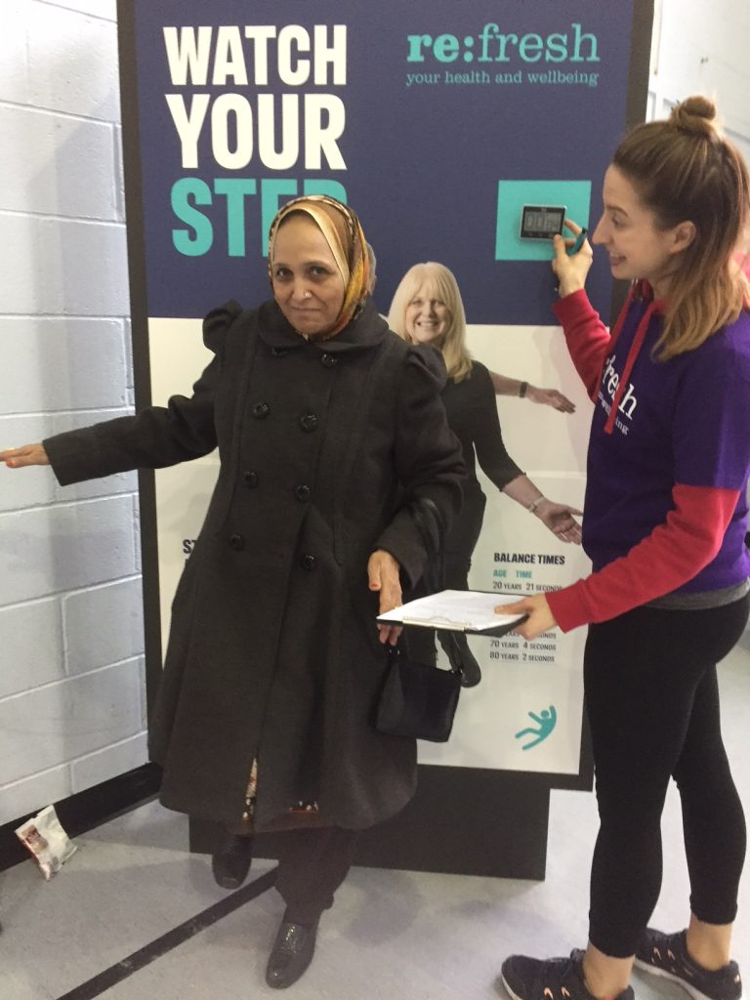

# Age Well
## Issues Affecting Older People
### Trips and Falls
Each year, around a third of over-65s will experience one or more falls, rising to 50% of over-80s. Falls in this age-group can result not only in pain and injury, but also loss of confidence and independence _[@PHE_fallsAOH]_. Hip fractures in particular severely impair the patient’s prospects of being able to continue to live independently, and also carry a high mortality risk _[@PHE_fallsAOH; @UEA2017]_. The fear of falling will often restrict the activities even of those who have _not_ yet experienced a fall themselves _[@PHE_fallsCONS]_.

#### Hospital Admissions
After several years of persistently higher-than-average falls-related hospital admissions, Blackburn with Darwen is now similar to the England average, both among the 65-79 and the 80+ age-groups _[@PHE_PHOF]_.

#### Hip Fractures
The overall rate of hip fracture for older people aged 65+ in Blackburn with Darwen has been close to average for several years. However, among the 80+ population (where most of these events occur), it is more erratic. The latest rate for this age-group was significantly above average, and one of the ten highest in England _[@PHE_PHOF]_.

#### Prevention and Response
```{block2, type = 'falls'}
* Blackburn with Darwen’s Falls Prevention Service offers targeted exercise programmes to improve the balance, strength and mobility of anybody over 65 who is at risk of falling _[@refresh]_. The Chartered Society of Physiotherapists estimates that such programmes in Blackburn with Darwen can produce a return on investment of £3.85 per £1 _[@CSP]_. 
* Home Assessment and Modification (‘HAM’) schemes aim to reduce falls risks by tackling issues such as loose mats, poor lighting and lack of handrails. They can produce a financial return on investment of £3.17 for every £1 spent, which rises to £7.34 per £1 when gains in Quality of Life are taken into account _[@PHE_fallsROI; @LGA_falls]_.^[These returns were achieved when HAM schemes were delivered to people who had already been hospitalised by falls. They would probably be more modest for a lower-risk population _[@PHE_fallsROI]_.]
* If an older person does fall, it is vital that help can be summoned quickly. Blackburn with Darwen now has over 2500 users of assistive technology, including falls pendants, alarms and bed occupancy sensors. Most are linked to the provider’s monitoring and response centre, ensuring a prompt and appropriate response _[@LGA_falls; @LGA_telecare]_.
```

##### Falls Prevention in the Asian Community
Concerned by the low attendance of South Asian heritage residents at falls prevention classes, Baiter Sehat (‘Better Health’) recently carried out a community engagement project on this topic with the borough’s BME communities.

Focus group disussions confirmed that awareness of these services was low. However, when a special demonstration event was arranged for Asian ladies, it attracted nearly 50 enthusiastic participants. The report recommends that such sessions should be provided within community settings, for men and women separately. These should be promoted both verbally and in writing, in languages familiar to Asian elders. Two residents volunteered to become ‘Falls Prevention Champions’, who will help to spread the message _[@OneVoice_balance; @OneVoice_falls]_.

```{r balancepic, fig.cap='Ladies "Strength and Balance" session organised by Baiter Sehat', echo = FALSE, out.width = '50%', fig.align='center'}

```

### Dementia
```{block2, type = 'papers'}
##### What the papers say....
###### Looking Ahead
Predicting the future burden of dementia is far from straightforward. Research at UCL and Liverpool University has concluded that: _**‘The risk of developing dementia at any given age is going down over time, shifting dementia to later years in life. This decline is mainly because of improvements in healthcare and adopting healthier lifestyles.’** [@UCL2018]_ 

Even so, the researchers predict a 57% rise in the number of people _living_ with dementia by 2040 in England and Wales, because of rising life expectancy.

###### Be Ambitious about Prevention 
These predictions assume a continued decline in incidence rates, and would be higher still without it _[@UCL2018]_. The study thus reinforces the key importance of public health measures aimed at dementia prevention _[@Sh_dementia; @PHE_dementia]_. Advice about how people can reduce their dementia risk now forms part of the NHS Health Check _[@PHE_dementiarisk]_.

Further new research, published in the Lancet, has quantified the proportion of new cases of dementia across the world that might theoretically be preventable _[@Lancet_2018]_. As shown in Figure \@ref(fig:dementiachart), modifiable risk factors are spread across the life-course, and together account for 35% of dementia incidence.

&nbsp;
<div style="text-align: right;font-size:80%;"><em>[‘Newspaper’](https://thenounproject.com/term/newspaper/154015) icon by Loïc Poivet from [The Noun Project](https://thenounproject.com)</em></div>
```

(ref:dementiacap) Risk factors for dementia^[‘Less education’ means no secondary education. This is much less common in England than it is worldwide, so it may account for somewhat less than ‘8%’ of the dementia risk in this country.] <em>[@Lancet_2018]</em>

```{r dementiachart, fig.cap='(ref:dementiacap)', echo = FALSE, out.width = '100%', fig.align='center'}

```

#### Dementia in Blackburn with Darwen
As at August 2018, GP practices in Blackburn with Darwen had a total of 1133 patients aged 65 or over who had been formally diagnosed with dementia. It is estimated that the true number of people aged 65+ with the condition is likely to be nearer 1531, so this means that around 74% of those affected have received a diagnosis (England average 67.8%) _[@NHSDig_dementia]_. The latest age breakdown is for April 2018, when the total number of diagnosed patients aged 65+ was 1123 (Figure \@ref(fig:dementiaprevchart)).

(ref:dementiaprevcap) Age/sex breakdown of Blackburn with Darwen patients aged 65+<br/>diagnosed with dementia (as at April 2018) <em>[@NHSDig_dementia]</em>

```{r dementiaprevchart, fig.cap='(ref:dementiaprevcap)', echo=FALSE,out.width='60%', fig.align='center'}

```

```{block2, type = 'dementiafriend'}
##### BME Communities
Previous work carried out by Baiter Sehat (‘Better Health’) has found low levels of dementia awareness within the local BME community, and a reluctance to come forward for diagnosis or accept help. There is significant stigma surrounding dementia, and no word for the condition in Urdu, Gujarati or Punjabi.

However, these barriers are beginning to be overcome, and there is now an increased desire to learn about dementia and how it can be prevented, recognised and managed. With the support of schools, mosques and local businesses, a growing volunteer force of Dementia ‘Friends’ and ‘Champions’ are spreading the message in ways that recognise the language and cultural needs of the BME community, and have helped turn Whalley Range into the the borough’s first ‘Dementia Friendly Area’ _[@OneVoice_dementia; @OneVoice_dfriends]_.
```

## Quality and Length of Life
### Healthy Life Expectancy
Everything within the Public Health Outcomes Framework is geared towards achieving two ‘overarching outcomes’, one of which is **increased healthy life expectancy**. The importance accorded to this indicator reflects the philosophy that the public health system should be concerned not just with extending life, but with improving health and wellbeing across the life course. The calculation of Healthy Life Expectancy involves splitting total Life Expectancy into the portion spent in ‘good’ health and the remainder spent in ‘not good’ health, based on responses to a survey question such as: _“How is your health in general?”_ (Figure \@ref(fig:HLEchart)) _[@ONS_expectancies]_:  

(ref:HLEcap) Healthy Life Expectancy - Blackburn with Darwen compared with<br/>150 upper-tier local authorities and England (2014-16)

```{r HLEchart, fig.cap='(ref:HLEcap)', echo=FALSE,out.width='80%', fig.align='center'}
knitr::include_graphics("Assets/p42fig89.png")
```

It can be seen that Healthy Life Expectancy in Blackburn with Darwen is 57.3 years for males and 60.0 years for females, both of which are significantly lower than the England average. The borough’s male Healthy Life Expectancy is the sixth equal lowest in England. When Healthy Life Expectancy is divided by total Life Expectancy, we find that males in Blackburn with Darwen can expect to spend 75.2% of their life in good health, and females 74.5%, which again is below average for both sexes.

If the 2014-16 results for Blackburn with Darwen are compared with 2011-13 (the most recent non-overlapping period), there has been no significant change. The same is true if we compare them with the earliest available set of results, for 2009-11.

The Public Health Outcomes Framework acknowledges that Healthy Life Expectancy is the sort of measure which can take a long time to show any marked improvements, which is why the overarching outcomes are underpinned by a large collection of supporting indicators _[@DH_outcomes]_.

## End of Life
### Cause of Death
It is natural to ask ‘What is the biggest cause of death in Blackburn with Darwen?’. The answer to that depends on how the causes have been grouped together, but if we accept the very broad classification used here, the biggest category is ‘Cancer & tumours’ (with 353 deaths in 2016), followed by ‘CVD’ (343). This means that Cancer has overtaken CVD in Blackburn with Darwen since the previous Summary Review, as it had already done in England as a whole.

(ref:deathcausecap) Cause of Death - broad breakdown, Blackburn with Darwen 2016<br/><em>(*small numbers suppressed)</em></br>Source: <https://www.nomisweb.co.uk/>

```{r deathcausechart, fig.cap='(ref:deathcausecap)', echo=FALSE,out.width='100%', fig.align='center'}

```

There is, however, no ‘right’ or ‘wrong’ way to split up the causes. The ONS prefers to combine the various forms of dementia, but split up CVD and cancers, which leads to the now-familiar headlines stating that Dementia and Alzheimer’s disease is the biggest cause of death in England and Wales _[@ONS_deaths]_.

